# Responsive Web Design
###### by University of London & Goldsmiths, University of London

<!--~~~~~~~~~~~~~~~~~~~~~~~~~~~~~~~~~~~~~~~~~~~~~~~~~~~~~~~~~~~~~~~~~~~~~~~~~~~~~~~~~~~~~~~~~~~~-->
<!--~~~~~~~~~~~~~~~~~~~~~~~~~~~~ 01.  (01) ~~~~~~~~~~~~~~~~~~~~~~~~~~~~~-->

## About this Course

In this course you will learn how to apply concepts from interaction
design and human computer interaction in order to design and build an
interactive, professional looking website. You will learn how to make
your web page designs adapt to different screen sizes using responsive
grid layouts. You will learn how to add navigation and other design
elements, and you will learn how to separate data and display using
JavaScript objects and templates.

### **Learning outcomes:**

By the end of this course, you will be able to:

-   Understand the basic concepts of usability and user experience

-   Tell the user where they can go with navbars

-   Tell the user what is here with effective layout

-   Understand the high-level requirements of creating an accessible
    website

### Learning Objectives:

1.  Explain why users need to know where they are, where they can go and
    what is on a web page

2.  Create wireframe mockups of web pages

3.  Identify the key functional elements of web pages

4.  Use Bootstrap components to realize page designs

5.  Use JavaScript data structures such as arrays and objects to define
    the data used in a web page

6.  Use the Handlebars template library to convert data to HTML

7.  Add interactivity to templates using JavaScript event listeners

### In this course, you will complete:

-   1 website design assignment taking \~1 hour to complete

-   1 programming assignment taking \~1 hour to complete

Participation in or completion of this online course will not confer
academic credit for University of London programmes.

## Syllabus

## Week (module) 1 - Web design principles

Welcome to the first module of \'Responsive Web Design\'. By the end of
this module, you will be able to understand the basic concepts of
usability and user experience and tell the user where they can go with
navbars. In addition, you will be able to tell the user what is here
with effective layout and understand the high-level requirements of
creating an accessible website. We hope you enjoy the module!

8 videos, 3 pdfs, 4 urls

1.  [Overview](https://www.coursera.org/lecture/responsive-web-design/overview-0avtb)
    -- Web Design Principles

**1.01a:** MOOC 2 Week 1 (pdf)

2.  Usability and User Experience

3.  Where Can You Go?

4.  What is Here?

**1.04a:** Web Accessibility Initiative (WAI) (url)

5.  Accessibility

**1.05a:** Edward Tufte (url)

**1.05b:** User Centered Design Process (url)

**1.05c:** Guidelines for Design (pdf)

6.  Guidelines for Design

**1.06a:** Stunning Design & Motion Projects (url)

**1.06b:** Design Examples (pdf)

7.  Design Examples

8.  Summary -- Web Design Principles

## Week (module) 2 - Realizing Design Principles in Code

Welcome to the second module of \'Responsive Web Design\'. By the end of
this module (2), you will be able to set up a basic **Bootstrap** site
and build **Bootstrap** collapsible, responsive navbars using titles and
breadcrumb trails and you\'ll also be able to build multiple layouts in
one with a responsive grid. We\'ll also be looking at installing
**Bootstrap** themes.

#### 9 videos, 3 zips, 6 urls

-   **2.00a:** Blank Bootstrap Site (zip)

-   **2.00b:** Final Version (zip)

1.  [Overview](https://www.coursera.org/lecture/responsive-web-design/overview-ImlJz)
    -- Realizing Design Principles in Code

-   **2.01a: **Download Bootstrap (url)

> https://getbootstrap.com/docs/5.3/getting-started/introduction/

2.  Basic Bootstrap Set up

-   **2.02a: **Basic Bootstrap Setup Starter Code (zip)

-   **2.02b: **Basic Bootstrap Setup (url)

3.  Where Can You Go?

4.  Collapsible Navbars

5.  Building Out the Site

-   **2.05a: **Bootstrap Breadcrumbs (url)

6.  Where Am I?

-   **2.06a: **Bootstrap Grid System (url)

7.  Responsive Grid

-   **2.07a: **Bootstrap Themes (url)

-   **2.07b:** Commercial Bootstrap Themes (url)

8.  Bootstrap Themes

9.  Summary -- Realizing Design Principles in Code

## Week (module) 3 - Adding content to websites

Welcome to the third module of \'Responsive Web Design\' By the end of
this module, you will be able to separate page structure from page
content, use JavaScript objects and implement JavaScript templates with
Handlebars as well as being able to display different data with the same
template and the same data with different templates. Finally, we will be
looking at using a **Bootstrap** modal. We hope you enjoy the module!

#### 8 videos, 3 zips, 2 urls

1.  [Overview](https://www.coursera.org/lecture/responsive-web-design/overview-WofnR)
    -- Adding Content to Websites

-   **3.01a:** JavaScript Reference Site (url)

2.  Separating structure and content

3.  JavaScript objects

-   **3:03a:** Handlebars Templates (url)

4.  JavaScript Templates with Handlebars

-   **3.04a:** 2.3.4 (zip)

5.  Putting Data into Templates

-   **3.05a:** 2.3.5 (zip)

6.  Displaying Different Data with the Same Template

-   **3.06a:** 2.3.6 final (zip)

7.  Displaying the Same Data with Different Templates, Use Bootstrap
    Modal

8.  Summary -- Adding Content to Websites

# Week (module) 4 - Building a full gallery app

Welcome to the fourth module of \'Responsive Web Design\'. By the end of
this module you will be able to store objects in an array and display
them with a template, and dynamically display single images from an
array. We will also be looking at implementing a search function, and by
working with complex data structures, switching between different
templates.

#### 8 videos, 4 zips, 2 url

1.  [Overview](https://www.coursera.org/lecture/responsive-web-design/overview-KKdql) -
    Building a Full Gallery App

-   **4.01a: **Code Developed in Lessons 2-4 (zip)

-   **4.01b: **Final Gallery (zip)

-   **4.01c:** JavaScript Arrays (url)

2.  JavaScript Arrays

3.  Storing Objects in Arrays and Displaying Them with a Template

4.  Dynamically Displaying Single Images from an Array

-   **4.04a: **Select Image (zip)

5.  Implementing a Search Function

-   **4.05a: **Source Code for the Gallery (zip)

6.  Data Structure for a Complete Image Gallery

7.  Writing the Templates for the Gallery

8.  Switching Displays in the Gallery

9.  Summary -- Building a Full Gallery App

## 1.01 Overview Responsive Web Design (0:32)

Welcome to the first module on the course. It\'s time to start thinking
about the user. How do they know what\'s on your web page? How do they
know where they can go? Well, in this module we\'re going to teach you
the basic design elements that you need to really communicate that to a
user. And Kate\'s going to show you some great techniques from
interaction design that help you do it. So I look forward to seeing you
on the first lesson.

### 1.01a Lecture slides (MOOC2-1.pdf) (modules 1.02-1.05)

> **Here are Kate\'s slides used for the following lessons:**

-   **Usability and user experience (1.02)**

-   **Where can you go? (1.03)**

-   **What is here? (1.04)**

-   **Accessibility (1.05)**

## 1.02 Usability and User Experience (2:29)

Welcome back, you\'re back at week one of the second part of responsive
web development and design. We\'ve gone really well so far.
<!--~~~~~~~~~~~~~~~~~~~~~~~~~~~~~~~~~~~~~~~~~~~~~~~~~~~~~~~~~~~~~~~~~~~~~~~~~~~~~~~~~~~~~~~~~~~~-->
<!--~~~~~~~~~~~~~~~~~~~~~~~~~~~~ 02.  (xx) ~~~~~~~~~~~~~~~~~~~~~~~~~~~~~-->

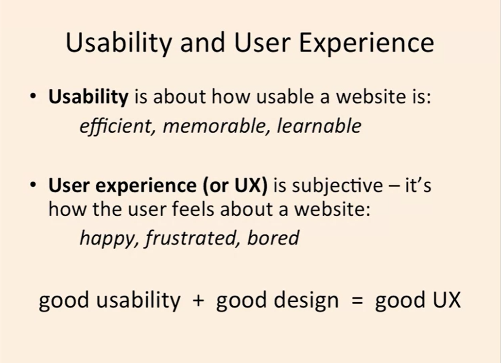

<!-- {width="3.0in" height="2.173718285214348in"} -->

This week, now that we\'ve learned the basics, we\'re going to look at
more of the principles, design principles, behind developing websites. I
want to look at some of the concepts that underpin web development. And
two things you\'ll hear talked about are **usability** and **user
experience**. **Usability** is fairly straight forward. It\'s about how
usable your website is. This might mean how efficient it is, how
memorable it is for your users, how learnable, how intuitive it is. The
other term, the **user experience**, which is often abbreviated to
**UX**, is something that\'s really come to light in the past few years.
It\'s become a very big industry. It doesn\'t just apply to websites.
It\'s also a big part of product design as well. User experience, UX, is
very subjective. It\'s about how the user feels about a website. Are
they happy? Frustrated or bored? And your aim is to give them a good
user experience. It\'s not something you can predict. It\'s not
something you can guarantee. But if you practice good design, then
hopefully they will have a good user experience. Good usability and good
design mean good UX.
<!--~~~~~~~~~~~~~~~~~~~~~~~~~~~~~~~~~~~~~~~~~~~~~~~~~~~~~~~~~~~~~~~~~~~~~~~~~~~~~~~~~~~~~~~~~~~~-->
<!--~~~~~~~~~~~~~~~~~~~~~~~~~~~~ 03.  (xx) ~~~~~~~~~~~~~~~~~~~~~~~~~~~~~-->

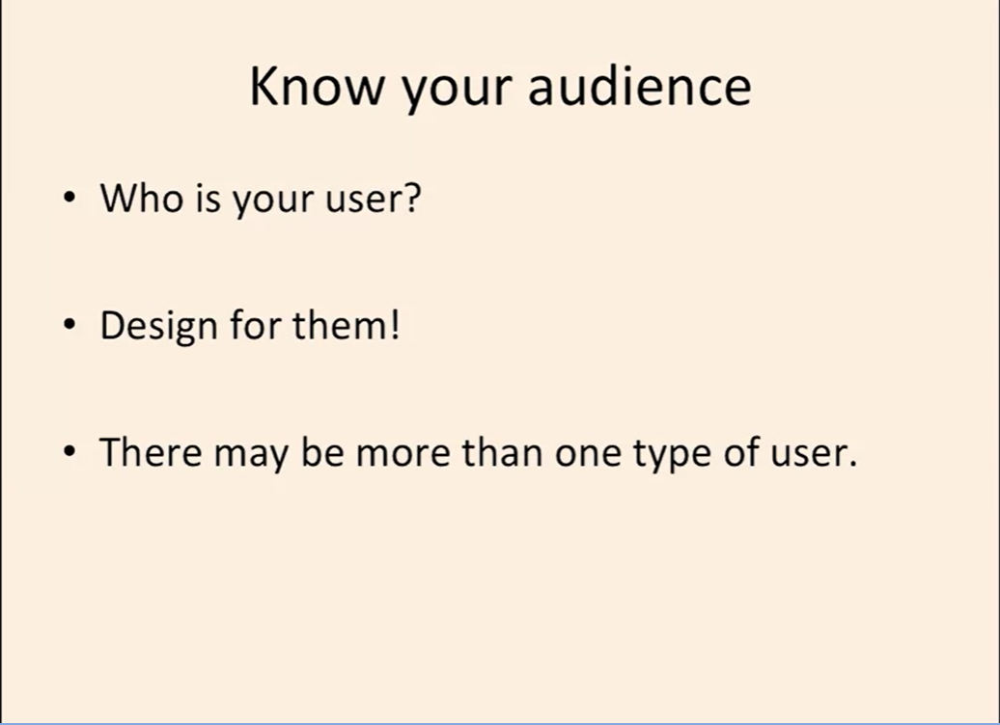

When thinking about making your website, know your audience, think about
who that website is for. Who is your user? Think about the type of site
that you\'re creating. If you\'re making some kind of ecommerce site,
you might have a particular consumer in mind who wants to buy a
particular thing. If you\'re making something for friends and family,
you probably know the level of expertise and experience that your users
have. Design for them, design with them in mind. Remember that you may
have more than one type of user, that\'s quite common, and you have to
look for a way of navigating between the different user groups.
<!--~~~~~~~~~~~~~~~~~~~~~~~~~~~~~~~~~~~~~~~~~~~~~~~~~~~~~~~~~~~~~~~~~~~~~~~~~~~~~~~~~~~~~~~~~~~~-->
<!--~~~~~~~~~~~~~~~~~~~~~~~~~~~~ 04.  (xx) ~~~~~~~~~~~~~~~~~~~~~~~~~~~~~-->

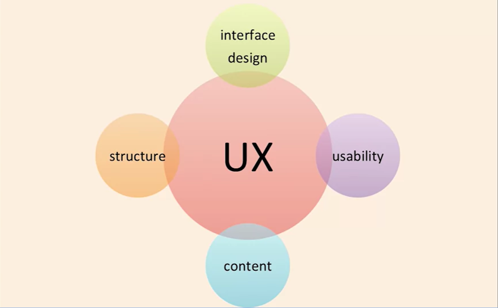

Under this umbrella of user experience come lots of different things,
interface design, usability, content, structure. And this week we\'re
going to be looking at the way we can apply design principles to achieve
this good user experience, so we\'ll be looking at things like how you
structure a page. How you make something accessible, and what are good
and bad examples of web design.

## 1.03 Where Can You Go? (6:02)

This section is looking at navigation. Where can I go?

Navigation is really important to websites, because if your user
doesn\'t know where they\'re going to go, they might just give up and
wonder off. If you want them to stay on your webpage, you better give
them some indication of where they can be.

Navigation can be **hierarchical**. And this is moving from the very
general to the very specific. It\'s a clear and simple path to all
elements and all parts of the website. It could be **global**, where you
have top level sections on each page. The user can easily go back to one
of those if they need to. Or it could be **local**, which then occurs
within the text of the webpage.

Now different cultures have different ways of navigating. But it\'s
crucial that you pick the right one. And before you can plan where
people can go, you need to think about the **site architecture**. The
way to do this is to plan out some kind of **site map**. **Site maps**
can be done with software, but it\'s pretty easy if you draw it out for
yourself. It\'s not a complicated thing to do. But if you start by
planning where you want your people to go, and what\'s available to
them, you\'re going to save yourself an awful lot of time.
<!--~~~~~~~~~~~~~~~~~~~~~~~~~~~~~~~~~~~~~~~~~~~~~~~~~~~~~~~~~~~~~~~~~~~~~~~~~~~~~~~~~~~~~~~~~~~~-->
<!--~~~~~~~~~~~~~~~~~~~~~~~~~~~~ 05.  (xx) ~~~~~~~~~~~~~~~~~~~~~~~~~~~~~-->

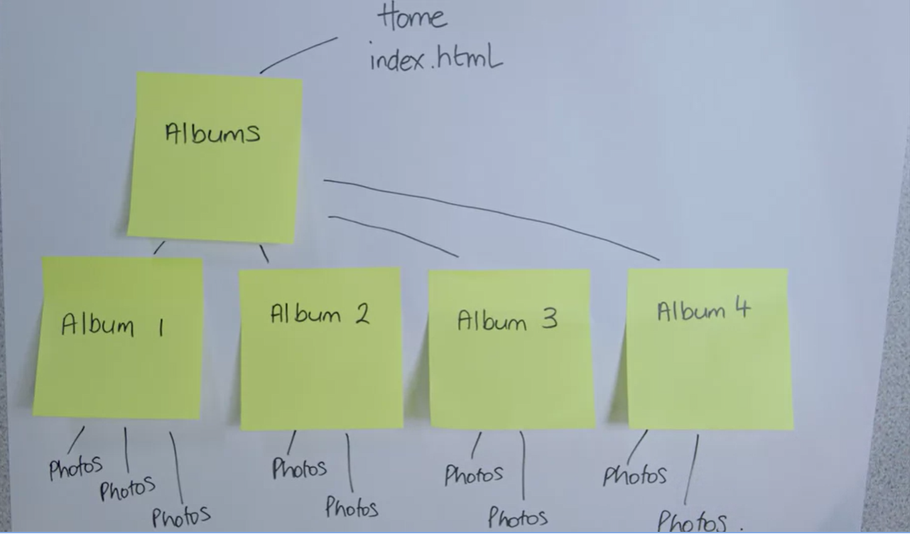

Let\'s work out how to draw a **site map**. A **site map** is a way of
visualizing your website. It\'s a way of planning it out, looking for
things like **navigation links**. Let\'s keep this simple and try and
draw one. Your **hierarchy** is always going to start on your home page
and that\'s your **index.html** file. And then after that we know that
on our gallery page, we\'re going to have some **albums**. We know
there\'s a link to albums. And in those **albums,** we know that we have
a **number** of them. We have four albums on our site. And the nice
thing about using Post-it Notes is that you can then rearrange your site
without having to redraw. Very handy, very low tech, but handy.

Under the albums we can go to four different places. And then under each
album, we know that we have **photos** in that album. And this is just a
way of structuring that hierarchy, checking that things are where you
expect them to be, so that when you go around and add in files and link
to things you\'ve got them all going to the right place. The nice thing
about it is, because it\'s so low tech, it\'s really, really easy to
change. Especially if you\'re using different components for it, and you
can just chop and change as you like.
<!--~~~~~~~~~~~~~~~~~~~~~~~~~~~~~~~~~~~~~~~~~~~~~~~~~~~~~~~~~~~~~~~~~~~~~~~~~~~~~~~~~~~~~~~~~~~~-->
<!--~~~~~~~~~~~~~~~~~~~~~~~~~~~~ 06.  (xx) ~~~~~~~~~~~~~~~~~~~~~~~~~~~~~-->

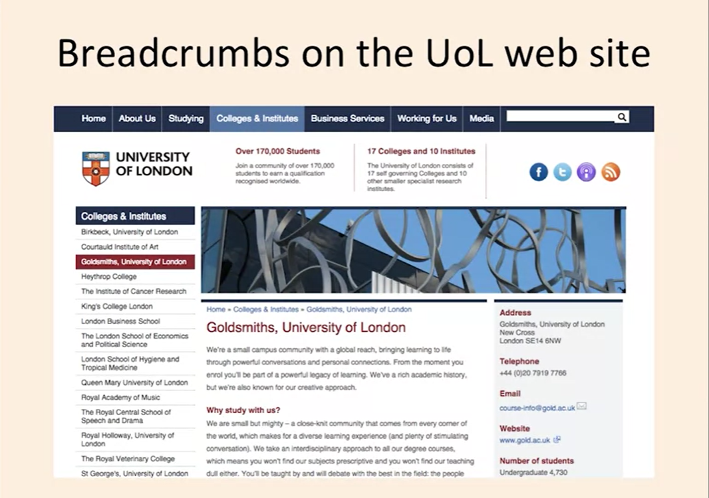

Now that you have an idea of what your site structure\'s going to be,
think about how you\'re going to let people know how they can find out
where they are within that site. One of the common ways of doing is
using something called **breadcrumbs**, or a **breadcrumb trail**. And
it gets its name from the fairy tale about Hansel and Gretel, who left a
trail of **breadcrumbs** so they could find their way home again.
<!--~~~~~~~~~~~~~~~~~~~~~~~~~~~~~~~~~~~~~~~~~~~~~~~~~~~~~~~~~~~~~~~~~~~~~~~~~~~~~~~~~~~~~~~~~~~~-->
<!--~~~~~~~~~~~~~~~~~~~~~~~~~~~~ 07.  (xx) ~~~~~~~~~~~~~~~~~~~~~~~~~~~~~-->

Here\'s an example of **Breadcrumbs** on the University of London
website. And you can see here, just under the picture, this is their
page about Goldsmiths, which is a college of the University of London,
and just underneath the picture from Goldsmiths, you can see a little
line of blue text. And those are links. And they are the
**breadcrumbs**, so we can see the top level is **Home**. Then we\'ve
gone down a page, down a level to Colleges and Institutes. Then from
that we\'ve selected and gone down another level to Goldsmiths, and
that\'s the page that we\'re on now. If we were to click one of these,
it would take us to the part of the website that it\'s named.
<!--~~~~~~~~~~~~~~~~~~~~~~~~~~~~~~~~~~~~~~~~~~~~~~~~~~~~~~~~~~~~~~~~~~~~~~~~~~~~~~~~~~~~~~~~~~~~-->
<!--~~~~~~~~~~~~~~~~~~~~~~~~~~~~ 08.  (xx) ~~~~~~~~~~~~~~~~~~~~~~~~~~~~~-->

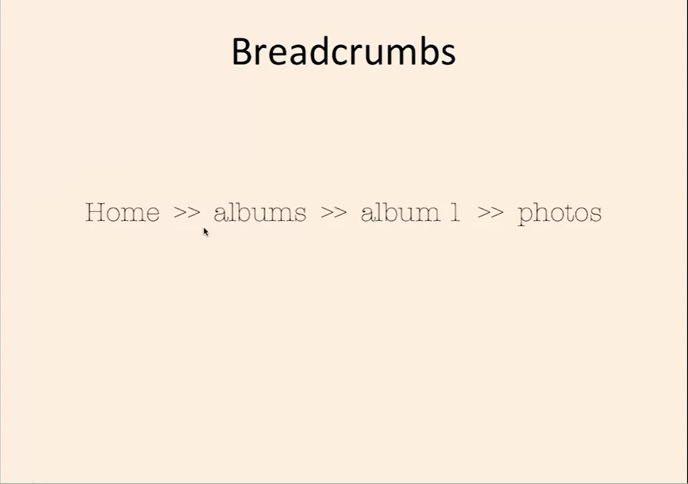

For our own website we may have **breadcrumbs** that look a little bit
like this. We could have the **Home** level, then the level of the
**albums**. Perhaps we have **album 1**, and then we\'re down at the
level of the **photos**. If we want to jump to any particular page on
the website, we can do so just by clicking on the **breadcrumbs**. Once
you\'ve decided on structure for your site and you\'ve worked out how
best to do your navigation, you need to think about the practical issues
about whether those links should be **absolute** or **relative**.
<!--~~~~~~~~~~~~~~~~~~~~~~~~~~~~~~~~~~~~~~~~~~~~~~~~~~~~~~~~~~~~~~~~~~~~~~~~~~~~~~~~~~~~~~~~~~~~-->
<!--~~~~~~~~~~~~~~~~~~~~~~~~~~~~ 09.  (xx) ~~~~~~~~~~~~~~~~~~~~~~~~~~~~~-->

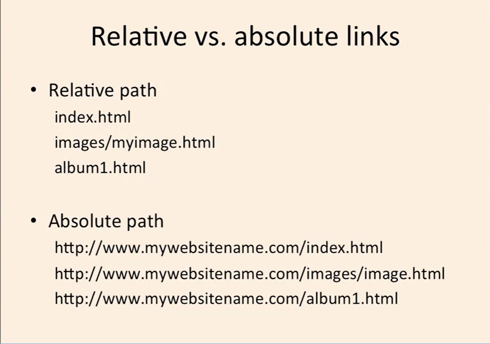

You can see here the difference between the two when you just look at
the file names. If you had a **relative** link, you wanted to link to
something within your site, you might just type **index.html** as your
link to the home page. Or if you had an image, your link to the image
might be **images/myimage.html**. Or if you wanted to link to a specific
album, it might be **album1.html**. Now this assumes that you have got,
where you are, you have access to all the files in that directory.
You\'re linking just to another file in the same directory.

If you were to make it an **absolute** link, then you would give the
**full domain name** for your link. In this case it would be the
**www.mywebsitename**, whatever that might be, **.com/index.html**.
Again, if you had one with images you might do
**mywebsitename.com/images/image.html**. Or for the album,
**mywebsitename.com/ album1.html**. You can see you\'re specifying an
actual URL, an actual web path, even if the file is within your own
website. Now there are debates over whether you should use **relative**
or whether you should use **absolute** paths and **absolute** links for
your website. The jury\'s out. I lean towards doing **absolute** ones
because it\'s easier in terms of search engine indexing. And it\'s quite
easy to change things and structure of your site if you\'re going to do
that. Without breaking link pass, so you can move things around in
different directories. But it\'s up to you, but do think about the
impact it will have if you change things around when you\'ve done
**relative** versus **absolute** links.

## 1.04 What is Here? (3:15)

So far, we have looked at where am I? Where can I go? Now we are going
to look at what is here? You have to stick to this model of where am I?
Where can I go? What is here? But is a really good way of beginning if
you are not familiar with building websites. It\'s a good way of
providing that usability for your users.
<!--~~~~~~~~~~~~~~~~~~~~~~~~~~~~~~~~~~~~~~~~~~~~~~~~~~~~~~~~~~~~~~~~~~~~~~~~~~~~~~~~~~~~~~~~~~~~-->
<!--~~~~~~~~~~~~~~~~~~~~~~~~~~~~ 10/11.  (xx) ~~~~~~~~~~~~~~~~~~~~~~~~~~~~~-->

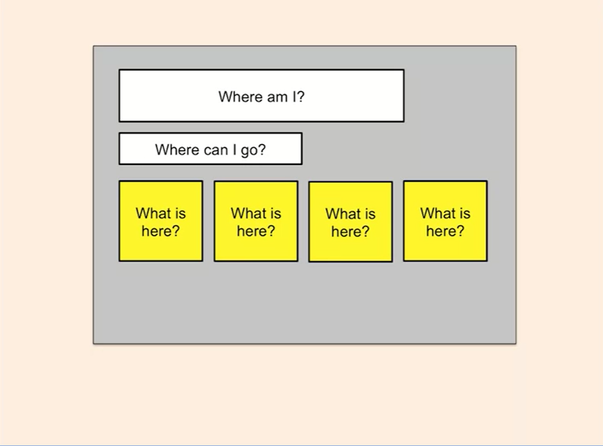
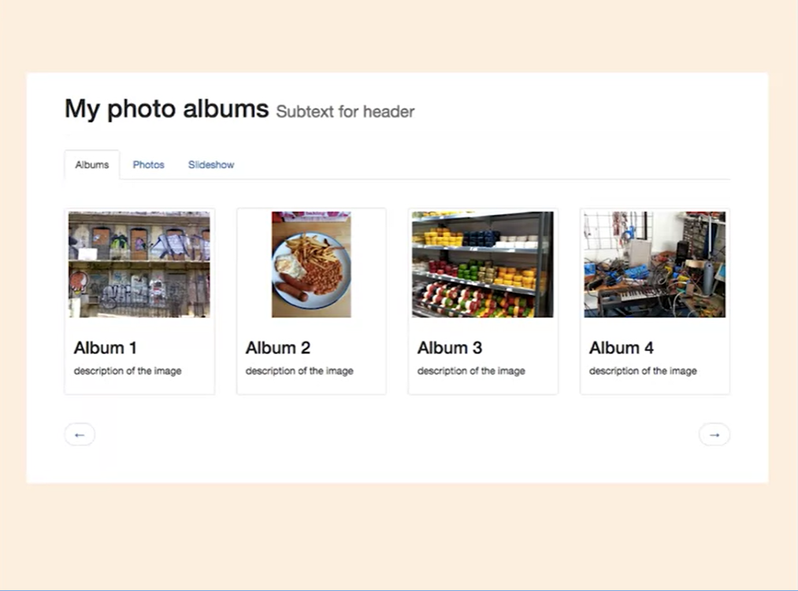

Now, we\'ve laid out our website, in a bit of a grid structure, so I\'d
like to talk a little bit about that.
<!--~~~~~~~~~~~~~~~~~~~~~~~~~~~~~~~~~~~~~~~~~~~~~~~~~~~~~~~~~~~~~~~~~~~~~~~~~~~~~~~~~~~~~~~~~~~~-->
<!--~~~~~~~~~~~~~~~~~~~~~~~~~~~~ 12.  (xx) ~~~~~~~~~~~~~~~~~~~~~~~~~~~~~-->

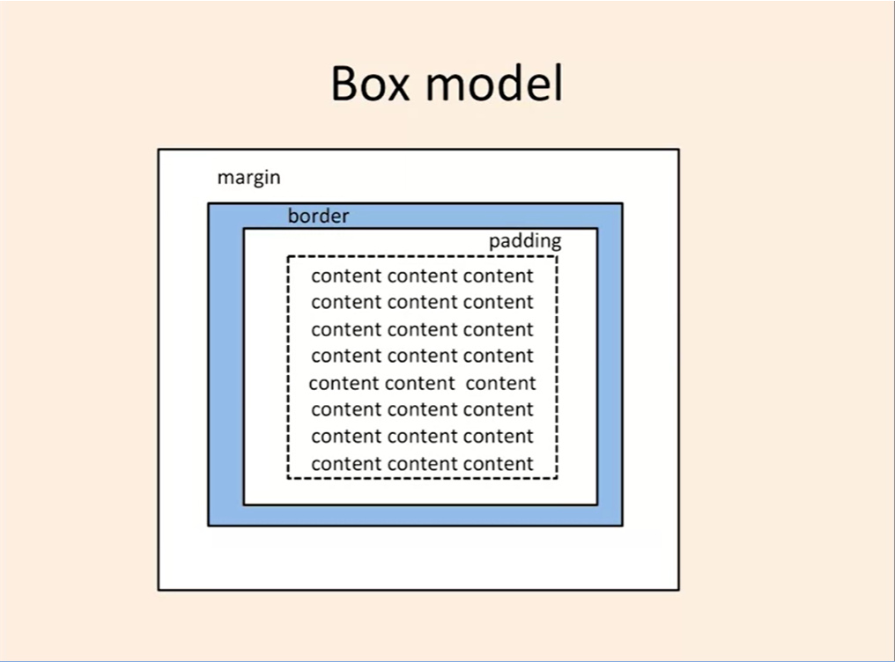

If you think back to the first part of this course. Remember the idea of
the **box model**. With CSS all the elements in a web page can be
thought of as a box, a rectangular box.
<!--~~~~~~~~~~~~~~~~~~~~~~~~~~~~~~~~~~~~~~~~~~~~~~~~~~~~~~~~~~~~~~~~~~~~~~~~~~~~~~~~~~~~~~~~~~~~-->
<!--~~~~~~~~~~~~~~~~~~~~~~~~~~~~ 13.  (xx) ~~~~~~~~~~~~~~~~~~~~~~~~~~~~~-->

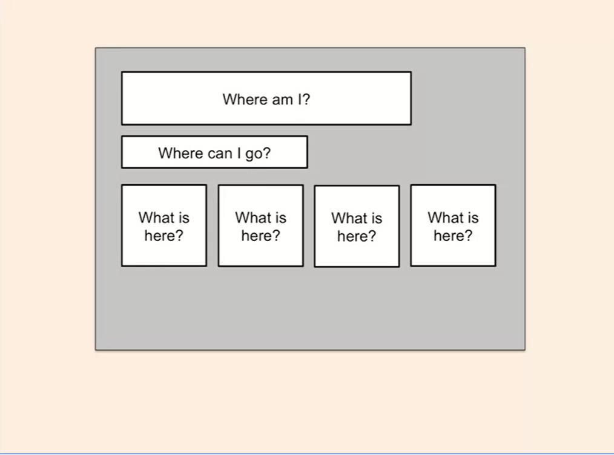

Take the idea of that **box model** and expand it and we\'re going to
think of our page as just a series of boxes. When we think about where
am I and where can I go, then underneath we\'ve just got the content in
a series of boxes. And we know this is way that people can look at
websites.
<!--~~~~~~~~~~~~~~~~~~~~~~~~~~~~~~~~~~~~~~~~~~~~~~~~~~~~~~~~~~~~~~~~~~~~~~~~~~~~~~~~~~~~~~~~~~~~-->
<!--~~~~~~~~~~~~~~~~~~~~~~~~~~~~ 14.  (xx) ~~~~~~~~~~~~~~~~~~~~~~~~~~~~~-->

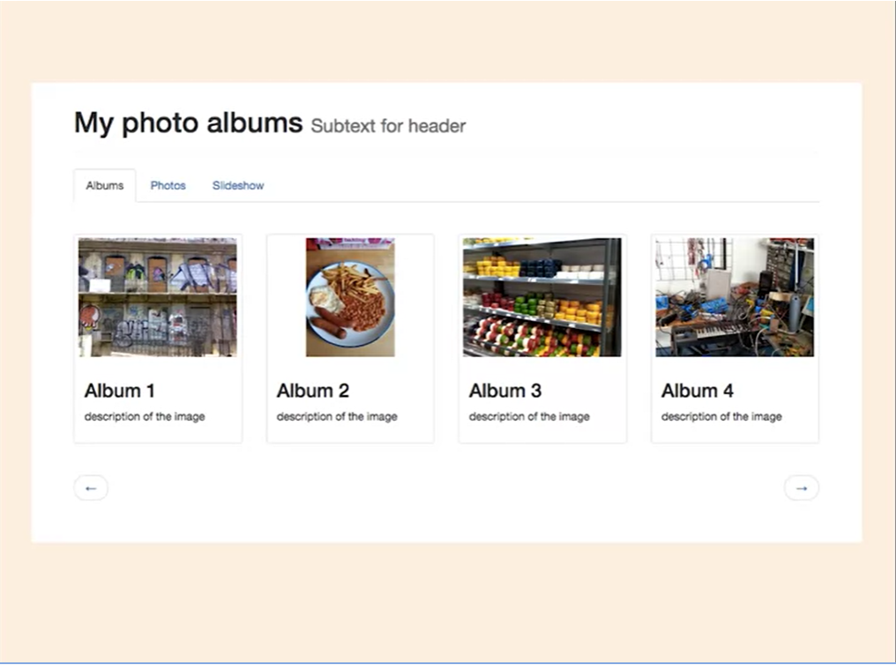

If we think back, here\'s our album that we\'re going to make. We have
four boxes here representing four albums. And they\'re all laid out in a
row. Now the nice thing about the grid layout and the idea of using
boxes is that it\'s very fluid and responsive. We can mix things up, we
can lay things out. In this box format.
<!--~~~~~~~~~~~~~~~~~~~~~~~~~~~~~~~~~~~~~~~~~~~~~~~~~~~~~~~~~~~~~~~~~~~~~~~~~~~~~~~~~~~~~~~~~~~~-->
<!--~~~~~~~~~~~~~~~~~~~~~~~~~~~~ 15/16.  (xx) ~~~~~~~~~~~~~~~~~~~~~~~~~~~~~-->

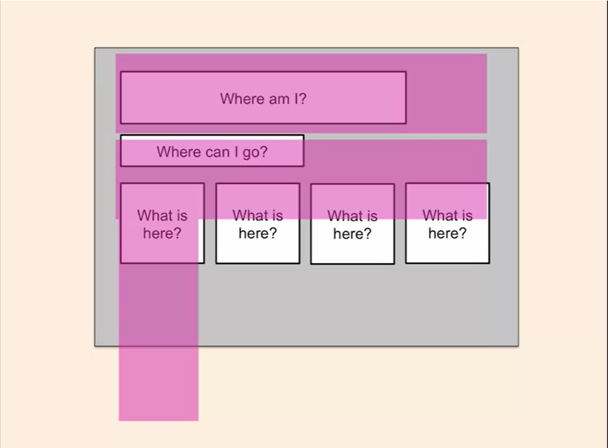
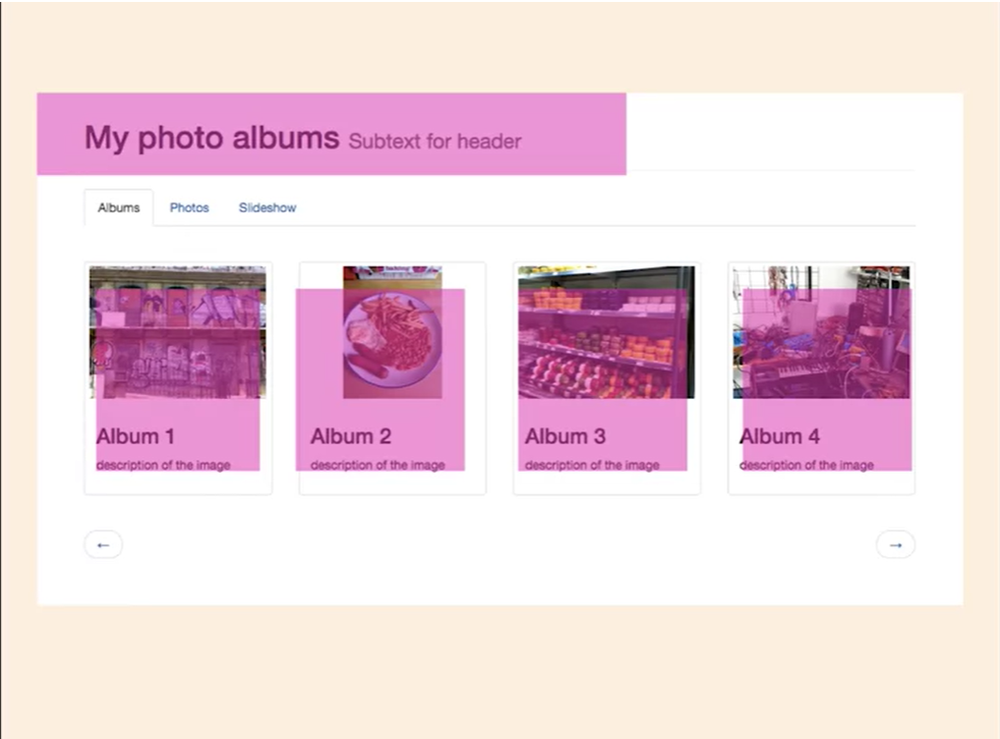

Here\'s that F shaped scaling pattern again of what people see in
websites. And you can see we\'ve captured those elements of branding of
navigation, but also, because we\'ve got the content in boxes you find
that people are actually, look at those boxes as well. It draws the eye
in. We know from other eye tracking experiments that also happens. That
people look for specific areas for content that have white space around
them. The nice thing about the grid layout is that you can break it down
into separate components.
<!--~~~~~~~~~~~~~~~~~~~~~~~~~~~~~~~~~~~~~~~~~~~~~~~~~~~~~~~~~~~~~~~~~~~~~~~~~~~~~~~~~~~~~~~~~~~~-->
<!--~~~~~~~~~~~~~~~~~~~~~~~~~~~~ 17.  (xx) ~~~~~~~~~~~~~~~~~~~~~~~~~~~~~-->

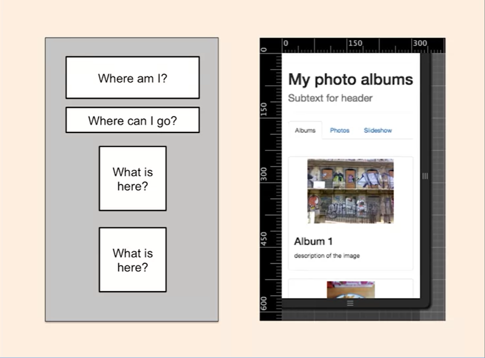

This is our mobile version roughly off the site that we\'re trying to
build. And you can see here that we kept the similar bits at the top,
the **Where am I**. Letting the user know what page they\'re on. The
**Where can I go**, which is our link that you see here. And the only
difference between the mobile version and the full version is that these
boxes become **responsive** and **fluid** and we can move them around.
In this case, they all fall one below the other so that you can scroll
through and see them each in turn.

The things you need to ask when you\'re putting your content onto your
website. Can the user find the content that they want? And you need to
make it really clear, and so that\'s why we see things like careful use
of white space, careful use of borders and height lines, to make sure
that we\'re highlighting the information that the user needs.

<!--~~~~~~~~~~~~~~~~~~~~~~~~~~~~~~~~~~~~~~~~~~~~~~~~~~~~~~~~~~~~~~~~~~~~~~~~~~~~~~~~~~~~~~~~~~~~-->
<!--~~~~~~~~~~~~~~~~~~~~~~~~~~~~ 18.  (xx) ~~~~~~~~~~~~~~~~~~~~~~~~~~~~~-->

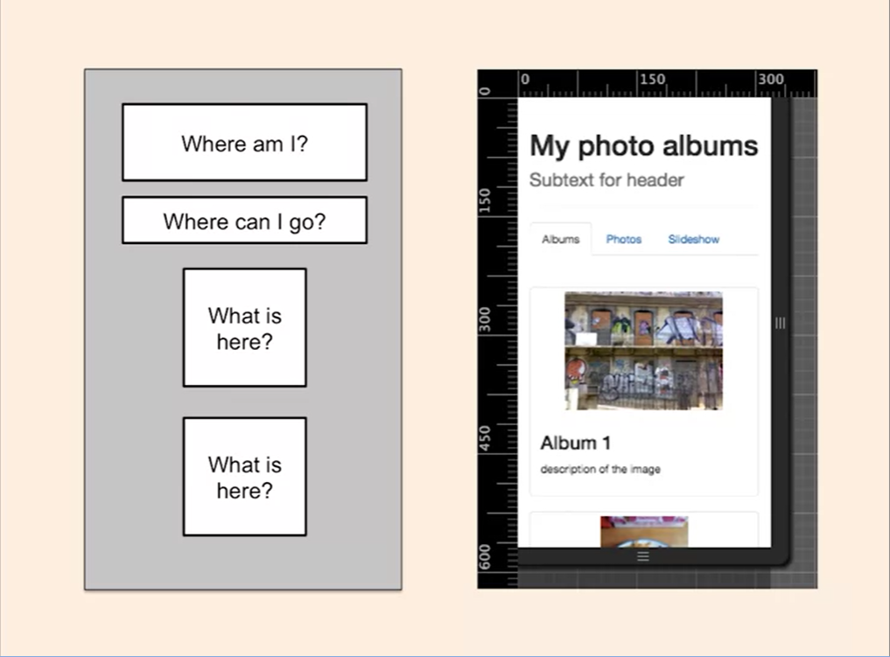

This grid structure is really useful. It\'s very effective because it\'s
modular and because we can move these components around. We must check
that the user can find what they want, and we\'ve done that here by
spacing out nicely. Plenty of white space, borders that draw the eye in,
and clear labels for each section. Every section on your web page needs
to tell a story so think about what your users looking at and think what
will catch their attention and draw their eye.

### 1.04a -- Web Accessibility Initiative (url)

We will be looking at the following web page in the next lesson:

**Web Accessibility Initiative** <http://www.w3.org/WAI/>

## 1.05 Accessibility (4:58)

We are now going to look at accessibility. Accessibility is really
important and falls under user experience. So, what is it? What is the
**web accessibility initiative**? What kind of things can you do to make
your site accessible? And how can you check that it\'s working? As
you\'ll see, **web accessibility** encompasses all disabilities that
effect access to the web. Now this might include visual impairments. If
someone isn\'t able to see content on the web in their browser, they
might have it read to them instead through a screen reader. They might
not be able to hear things particularly well, so they may need captions
of some sort if there\'s multimedia content. They might have motor
difficulties, physical difficulties that make it difficult to control
input devices like a keyboard or a mouse. Hence, some kind of adaptation
is required. They may have difficulty with speech. They may not be able
to use speech interfaces. There may be cognitive or neurological
difficulties that stop them from accessing the content in a particular
way. Thing about accessibility is, that designing for a good
accessibility means you\'re being very inclusive and you\'re designing
for everyone. It\'s a better user experience all around.

This is the **World Wide Web Consortium\'s Accessibility Initiative**.
They have a huge resource on their website for getting started with web
accessibility. It\'s addressed to people who use the web and how they
can set up their browsers to the best way of viewing content. And also,
accessibility basics for people designing websites. There\'s plenty of
information about it. They give you an introduction to accessibility.
What factors you might need when you\'re designing a webpage. And they
give you the guidelines, the web content accessibility guidelines for
websites and web applications. They also provide a list of resources and
tools. Things like how to evaluate your site to check for accessibility.
A common form of making something accessible, is to use a screen reader
or a text only browser for people who have any kind of visual
impairments. This is an example of that.

Here on the screen, we have the Goldsmiths University of London page on
the University of London\'s website. And this is the one we looked at
previously when we were looking at breadcrumb trails. It\'s just
basically some links, some content, some contact information. For anyone
who isn\'t able to read that, you can get browsers that will turn that
purely into text, and then you can have plugins that can read it aloud.

Here is a text version of that, using an extension called **Textize**,
that prints out the text only version for you, removes all formatting,
so you\'re right down to the content without any modification. To take
that a step further, you can then use an extension such as Chrome Vox,
that if you enable it, will allow you to have that read to you. So, for
example, here we are. And I can turn it on so you can hear the webpage
being read out. \>\> Text. \>\> Extensions Tab. **Textized** University
of London Goldsmiths. University of London, tab, Goldsmiths University
of London Undergraduate programs, link. Postgraduate programs, link.
Short courses, link. \>\> And you get the idea.

Looking at the **Web Accessibility Initiative\'s** easy checks, it\'s
clear to see the kind of very simple practical things you can do to make
sure your webpage is accessible. Always give your page a title. Make
sure that if you\'ve got an image, as we\'ve said before, it has some
kind of alt-text. An alternative text description. So that you describe,
perhaps the contents of the picture. Make sure your headings are
actually headings and they\'re not just different sized fonts. Make sure
your contrast is good, so that you\'ve got a good balance between light
and dark. Light background, dark text, or vice versa. Make sure the text
on your page can be resized, so that anyone who needs the text a little
larger will be able to do that themselves. And make sure that there are
alternatives to any multimedia you include, so if you have a video, make
sure there are some **captions** on that video, some **subtitles**. And
if you have audio, make sure you have some kind of **description** as
well (alt and title). Essentially, check through all of your site to
make sure that it can be accessed in a number of ways. And you can do
that by turning images on and off, by turning scripts on and off, just
to see how well the page stands up on its own.

### 1.05a - URLs for this next lesson (url)

We will be looking at the following web pages in the next lesson:

-   **Edward Tufte**: <http://www.edwardtufte.com/tufte>

-   **User centered design**: <http://www.w3.org/WAI/redesign/ucd>

### 1.05b -- Guidelines for Design (pdf)

-   Guidelines for Design:
    https://github.com/bbauska/ULondon-RespWebDesign/tree/main/PDFs/1.05_Guidlines_for_design.pdf

## 1.06 Guidelines for Design (10:31)

We\'ve been looking at user centered design. And we\'ve been trying to
think about how we use those approaches to understand the way that
websites should be laid out. And we\'re primarily doing that so that we
understand how to work with clients. And how to understand products, so
we can deliver products in a way, on the web, that makes sense with the
approaches that the client is requesting. And also understand what it is
that users want to do. I want to summarize some of these ideas and kind
of give you an overview. And then also use some examples

to define what you can do, and perhaps what you shouldn\'t do, when
you\'re working with a client or perhaps on your own with your own
business, to put a website together. We\'ll start with some basic
guidelines and these guidelines are roughly drawn up from two main
sources. And I think that, to be clear, they are not exhaustive,
they\'re not designed to be exhaustive. They\'re just to give you
something to refer back to when you\'re starting getting going with this
process. And when you\'re working with other people to do work like
this. We\'re going to take a look at some samples of good design
practice and bad design practice.

And we\'re going to be constructively critical about them, in order to
find out what we might avoid doing, as well as what we might want to do.
And we\'re going to try and define useful guidelines, just for getting
things done quickly. And as I was saying, this is not a lesson in
design, it\'s not a design MOOC. This is just some guidelines to help
you understand and work with designers and finalize designers. It\'s not
a lesson in illustrations or graphics, it\'s just guidelines, basic
rules of thumb, which you can apply in your projects. And it\'s not a
full-blown lesson in user centered approach. It\'s either just a summary
to get your head around what you might do. And we just learning to be
critical about websites, so we can understand and avoid common mistakes.
And look at examples of good practice, and see why they work.

As I\'ve said, there\'s going to be two main approaches that we\'re
drawing on. And the first one we haven\'t really talked about yet, and
Kate hasn\'t mentioned it either. This is the cognition and
**evidence-based** principles. And this is slightly different to some of
the other approaches, but it\'s also very useful when you\'re working on
your own, or with a client, and you don\'t have lots of users. You can
use a model of what you think your site is supposed to offer, to try to
design your approach. And one of the great exponents of this approach,
the evidence based, **cognition-based** principle of design, is Edward
Tufte. And one of the main ideas that he tries to get across to people,
in terms of understanding good design process, is to try to be clear
about what the information is, okay?

How do you make information clear? This is useful when you don\'t have
lots of time to work with users. It\'s useful when you\'re not really
sure what it is that people are going to do. Maybe it\'s a totally
different kind of site. Then you\'ve got to narrow down where the
content is and what that content\'s going to be. That\'s the Edward
Tufte approach. And we\'re going to use that alongside the stuff we\'ve
already been talking about, the user-centric approaches. And roughly
summarizing those approaches, the user centered approaches are focused
on who the users are, what the users want, and how they\'re going to get
the information. Who they are, what they want, how they\'re going to get
their stuff. This is the first rule that I am going to summarize for you
now. User experience first.

Now, a lot of people will tell you that the Edward Tufte approach, which
is all about information and evidence, and the user centered design
approach, which is all about who those people are, and what they want to
do, are pretty conflicting approaches. And that\'s true. They\'re both
useful, but they\'re not necessarily on the same page about everything.
And that\'s not a problem, we can cope with that. But there\'s one area
where both those approaches fundamentally agree, and that\'s on the idea
that user experience is primary. Before you do anything else you should
consider the experience, okay? User experience must come before any code
is written, all right? And user experience must be consistent. I think
I\'ve been saying this all along and it\'s kind of obvious, but,
consistency and the inner coherence of something is what makes it
understandable and readable, yeah?

If something looks like it\'s come from one side, and the rules apply
across that side, then you\'re starting to make some kind of sense. But
also, the way that the user is supposed to use the site has to be very
clear from the beginning. When someone goes to a site, they normally
know why they\'re going there. It might not be that it\'s the right
site, in which case, let them go somewhere else. You\'ve got to say,
this is what I\'m offering, here it is, up front. This is the evidence
that you need to make an assessment about whether this is where you want
to be. You\'ve got to try and get that information to users as quickly
as possible. Sites that contain very different designs with different
areas are very confusing for users. Stick to your CSS template, that\'s
the point of having a CSS template. You\'ll be surprised how many **big
name** websites make this mistake. You go to one part of the website, it
looks like one thing, you go to another part of the website, it looks
like something else. And it\'s been designed by different people, and
there\'s been no thought about how they interact. You may as well not
have the same website if you\'re going to do that. But not understanding
user experience is the cause of many major mistakes in almost all forms
of software development.

And software is often written with no clear idea how it\'s going to be
used. And that\'s worse than not doing anything. If you\'re not sure how
the software\'s going to be used, don\'t even bother writing it, right?
Figure out what the use is for your website, get it clear. It doesn\'t
matter whether you\'re Edward Tufte or whether you\'re Human Factors\'
researcher, that\'s the primary idea. The next concept, it leads on from
that, and it\'s WTF. What\'s this for? When presenting information, you
need your visitors to grasp what the information is quickly. You can
judge a good design by how long it takes you to understand what it\'s
about, all right? If you\'re looking at a website, and you\'re not
really sure what it means, that\'s a problem for the site. It might look
nice, it might seem presentable, but do you know what it\'s for? That\'s
the most important thing. The user visits the website looking for
content. You\'ve got to understand and clearly signpost that content.
And I can\'t underline this enough, that\'s a fundamental principle.

What\'s it for? Why am I here? Give a readable signpost. The second
major guideline I want you to follow, obfuscation versus simplicity,
okay? The worst kind of designs are those that look like corporate
annual reports, according to Edward Tufte. And what he\'s basically
saying is that its confusing content padded together with generic
imagery. If you\'re looking at something and you\'ve got a lot of
information, there might be a lot of text, but you\'re not sure from
scanning it what it means, then maybe it\'s padding. And then maybe
there is nothing. It looks like it\'s fine on the surface, but when you
just start to read it and you\'re not sure what you\'re doing, this goes
back to this user experience idea.

That user experience, it\'s challenging. The user doesn\'t really know,
even though it looks like there\'s content, even though it looks nice
enough, it looks professional, but they might not have any idea what it
is. And that is a major problem. And that\'s what happens when you look
at, according to Edward Tufte, that\'s what happens when you look at a
corporate annual report, yeah? It\'s something, somewhere in here is
important, but you\'re not sure where, and the images are there to
remind you that it\'s all professional. People wearing suits with
glasses and nice out of focus office backgrounds. Beware of these kinds
of websites, because you don\'t really know what they\'re telling you.
They\'re not designed to be read by anyone, and they\'re not really
targeting you in the way you think. I\'ve got one good example of that I
want to show.

Simpler websites are better. Again, what\'s this for? What is it? What
is the content? A news item, a product, a download. That\'s the first
thing the user\'s thinking. What is this? The second thing is, where can
I get it? The minimum number of clicks to get to content. If content is
not on the front page, I want it in one click as soon as I know what it
is. If I have to wait longer than that, there\'s got to be some
corporate reason. Some kind of business logic of why you\'re delaying
that transaction. Most websites don\'t need that kind of delay. If you
want someone to use the site, get the information to the user quickly.
This is what it is, here it is, get it, grab it, go.

That\'s the experience people want. What is it? Where can I get it? Why
is it here? If it\'s not helping users to do the above, get rid of it.
That includes all the color. I mean, everyone says color is great. Put
color on our website and make it look colorful. And maybe that\'s true
because color is inexpensive on a website. But why use those colors?
This is the golden rule. I\'ve mentioned this before and I\'ll always
mention this. If you can\'t think of a reason why the color is there,
don\'t use color, just use white. Pick something very simple. Only build
things in that make some kind of sense, so that there\'s a coherence to
the overall philosophy of the experience. Colors bring with them
confusion, use them sparingly. Pick very simple color palettes to begin
with. Slowly build from that. There\'s nothing wrong with black and
white. Black and white and red, that\'s the BBC website. All right, very
simple. And that\'s, I think, one of the top 20 websites in the world.
So why use color? Because it looks nice? That\'s not a good enough
reason.

### 1.06a -- All Websites Look the Same (url)

<http://www.novolume.co.uk/blog/all-websites-look-the-same/>

### 1.06b -- Design examples (pdf)

./pdf/1.06b-Design-examples.pdf

## 1.07 Design Examples (16:09)

The most popular websites in the world use precisely the approaches that
I\'ve just been outlining to you. Okay. Google, which I guess we should
now call Alphabet. Let\'s take a look at that. This is the most popular
website in the world. I\'m logged into it. It\'s telling me a few things
but they\'re over there in this corner. Basically, all I\'ve got, is
this thing which tells me what the brand is, which costs quite a lot of
money I hear. And I believe there was some BBC involvement. I don\'t
know. And then we just literally have a box, a box in the middle, and
this is the classic piece of design from the last 20, 15 years that
everyone\'s been talking about. I know exactly what I\'m doing, it says
search in the box, I can search, and it\'ll give me a result. I can
search for Coursera and immediately it\'s given me. I can\'t even spell.
I don\'t even have to spell, that\'s great! And I\'m where I want to be.
Just because I\'ve left the Google website, doesn\'t mean Google\'s a
bad website. That means Google\'s a good website. Okay, getting people
to stay on your site is great. But once they\'ve got what they want,
then they\'ll come back next time when they want the same thing.

Let\'s have a look at some other websites that use the same kind of
approach. Now I\'m already logged in here, but these sites I\'m not
logged in, because I don\'t have logins for these sites. But Twitter
again, this is a site which is one of the most popular websites, web
platforms in the world, is saying, welcome to Twitter, this is what it
does. A tiny amount of text like maybe 20 words or something 30 words
saying, this is what it does, this is how you get it. Go, get it,
that\'s it, the simplest approach. And then we\'ve got this **navbar**
here with hardly anything in it. It\'s like the two things you want to
know, what it\'s going to do, how you\'re going to get it. Pinterest,
it\'s exactly the same.

We\'ve got some images in the background that are blurred out that look
like some information we might want, pictures of stuff that we might be
interested in. There\'s that weird Gherkin thing. All I\'ve got to do is
log in, and it says, this guy used Pinterest to discover hidden London.
Pinterest is a way of people sharing information about places, I can log
in with my stuff, and I\'m there I\'m done. You missed a spot! Don\'t
forget to add your email. They\'re just helping you, all they want you
to do is log in and say, if you log in, we\'ll give you information.
Their business is actually users using their site, and they\'re just
saying, okay, we want you to log in, and in return, we give you all this
stuff. Tumblr. The same thing. It\'s the same site. One big picture
that\'s telling you a bit about the kind of content. We can search here.
This is the most complicated one we\'ve seen so far. We log in, and we
get loads of experience. Okay? It\'s very, very simple. And their all
themed. All these different sites.

There is a theme here says, What is Tumblr. Oh, look! Got a lovely
little thing opens up and it says, it\'s so easy to use it\'s hard to
explain. So their already thinking about that issue, how do you explain
what it is. And they\'re saying its a really simple way, it\'s a simple
way to allow people to make pictorial information on the Internet.
Right. This is another information sharing website. This is the number
one product in the Internet, how do we share information about users.
The users are the product, all these websites do that. They capture the
users quickly, and they get, that\'s how they make their money. That\'s
basically it.

These are all solid examples, but what happens if you\'re not a Googler,
your product isn\'t people. What happens if your product is holidays?
Well, service websites, basically the idea is you put the service up
front and center in the same way. And one of the most popular of these,
and one of the most lauded. Is Trip Advisor. Trip Advisor website, it
won Best Website of 2014 I think, or possibly 2013. Well, it\'s a
popular website. And one of the things that it did very well, is it put
the content front and center. Rather than going to a website that said,
like an advert, oh, we can do this. We can do that. We can do all these
things. It already assumed that the user visiting the website wanted to
find somewhere to go on holiday. It\'s got a search bar just like
Google. Plan your trip. You put the dates in, you say where you want to
go, and it just finds you the hotels and you sort it. And that\'s an
award-winning website, because it\'s simple. It\'s giving you,

I mean this is a bit too complicated. Since that time, it\'s got a bit
over the top, but there was a time when it was just one background image
with just one search bar, and again, you know, very popular design. Look
at this, Skype, this Skype page here, you\'ve basically got what looks
like a **Bootstrap** page, you scroll all the way down. Now we\'re going
to talk about **Bootstrap** in a minute, but you can see, hopefully
you\'re starting to understand why we\'re talking about **Bootstrap** in
this course. It\'s because it helps us to get these elements right, more
simply, encapsulates a lot of these elements we\'ve been talking about.

This Skype website, if we launch it, we get this video which explains
exactly how it\'s being used. But the video doesn\'t interrupt, you can
see that it\'s slightly dulled in color. It doesn\'t interrupt the text.
I can still read the text in front of the video. And again, that\'s the
same thing with the PayPal website. Look at this. It\'s a **Bootstrap**
template, okay? It\'s a responsive **Bootstrap** template. It\'s got
this image, the same size as on the Skype website. It says what the
product is It gives you simple links, login, and setup. And it tells you
exactly what it does. Tells you exactly what PayPal does. Okay, so
let\'s have a think about what this means. **Bootstrap** is one of these
things which helps us get these things right quickly. Let\'s have a
look. This is a **Bootstrap** themes website. In itself is a
**Bootstrap** theme, and you just, and as we\'ve already described, what
they do is two things. Well, they do more than two things. But they make
stuff very clean, they make stuff very simple.

They make it very easy for people to find information they want. So
that\'s the first thing. The second thing they do is they make it
respond to different sizes Of device. And that\'s important when people
are carrying around devices with different size screens, but they want
to have the same experience. In the past, people would employ at least
one designer per platform. And these days, it\'s appreciated that\'s
untenable, because there are so many very popular platforms. So now they
want one theme, which manages all these issues and that\'s why it
exists. That\'s why we have **Bootstrap**. But, there are problems with
this model. Notably, there was a recent post by, novolume.co.uk about
the issues that designers face with this. And I\'d recommend that you
take a look at this, because the idea is that, does it just mean that
all these websites look the same? And as we\'ve already seen, yes it
does, they all look the same. Like a bar at the top, there\'s a big
image, simple nice text, and then you scroll down, and then when you
change the size, you get the same thing. And you got your social media
at the bottom. And the idea that these are unique websites is amusing
that they\'re not unique websites. They all have the same design ideas.
The whole philosophy is reduced. It doesn\'t make it easier for us to
get things right. It does allow us to use the ideas that we\'ve been
talking about, very simply, but at the same time, be aware that sooner
or later, that\'s going to change. People are going to try something
else. But right now, that\'s what people are doing. So let\'s have a
look at some examples of bad practice. I have a litany of bad websites
to show you. Let\'s start with the funny ones.

This is a famous example of a bad news website. And I could just say it
looks 90s, but that\'s not helping us understand it. Firstly, it\'s
inconsistent. Each header is different color, right? That\'d be really
nice. Let\'s add some color. We can make every wall a different color.
But, why would you do that? It\'s a really stupid idea. We\'ve got four
columns. One, two, three, four. I can\'t scan the text, because the text
is too small. In general, we have a mixture of color on this navigation
bar as well. And it\'s just impossible for me to actually to understand
which one I should look at. It\'s distracting from the content. We\'ve
got too much content on the page. We have too many articles all at the
same time. We\'ve got too much use of color. Also, it\'s inconsistent.
We have the navigation bar on the side. Well, it would be okay, but
it\'s not the same size as all the rest of the columns. When we talk
about consistency, we don\'t just talk mean in terms of color. We also
mean in terms of sizing and padding. And this is all over the place.
Again, too much stuff, too much content.

Look at all this stuff we do, we do all this stuff. Nobody knows, nobody
cares. They can\'t remember it. It\'s like oh, I can just get, there\'s
like, this looks like the advertising page in the back of a magazine,
for poorly made low quality adverts. And, it\'s a web site nightmare.
Again, loads of different colors. We\'ve got red, blue, a weird pukey
yellow and green and purple, all together. We don\'t need any of those
colors. Look at, text is just all over the place. And there\'s no rhyme
or reason to why any of the images are where they are. They\'re just
randomly placed on the screen. Now even if there are only a few them, if
the images are randomly placed, that\'s bad, right? One bit of text and
three randomly placed images, bad. But this is like all over the place,
so it\'s all kinds of bad. This is another one which is famous. I\'m
looking at this, I have no idea what it\'s for. It\'s an ad, yeah, I
think, so it\'s the 28th Country Show. It\'s, oh, I don\'t know what to
say. Yellow, yellow text. Yellow text, why? Why would you make text
yellow? What\'s the thing? Is it because you want it to glow in the
dark?

All our users are reading this in the middle of the night and they
can\'t see normally. Great, brilliant. And we\'ll put that next to some
blue text, with like drop shadow. Why would you? Okay, that\'s fine, but
why? Just a reason, no reason. This, okay there\'s a video on this,
that\'s a good start. But again, we\'ve got a brown back, why have a
brown background? Why would you have, I\'m not saying why in some ironic
way, I just want to know why. And the fact is there\'s no reason other
than the person likes brown. Bad. Okay, the text is all over the place,
we have stretched text with a drop shadow, right, so firstly, most
designers, if you ever ask them if they can stretch the text, they\'re
going to be like, what are you talking about? That\'s crazy? That\'s
like going to a mechanic and saying, can you put water in the engine,
it\'s like, argh! So yeah, you just don\'t do that. This looks, yeah, at
least the background\'s full of these links is the same color. But
what\'s this? It\'s just like a rainbow, it\'s horrible. Again, we\'ve
got this weird background, this marble, I can\'t read it. Oh yeah, the
less said about that the better. I\'m not sure what I can say about
that, all this. Again, inconsistency in terms of where things are
placed, there\'s a Facebook link. Yeah, better off just having that.
You\'ve got this is a navbar. These two colors, why have these colors?
Again, color backgrounds, what\'s the point of having a color
background? Why choose one over another. The titles are inconsistent,
there is an inconsistent padding from this side to this side. This
numbering is just madness. You know they are in different places based
on the centered images. Again, central justifications are extremely
dangerous, so probably would avoid it. Different colored, yeah exactly,
different colored text here highlighted, very interesting, different
sizes of texts. Yeah, that\'s craziness. That\'s also craziness. Yeah,
all kinds of craziness. You can see that all these sites are really bad.
We have a litany of bad websites. But we also have deceptive approaches
and I want to show you one. And this allows us to fall back on what
Edward Tuft was saying about corporate approach. Not that being
corporate is being bad. But the notion of a corporate report being
difficult to understand, not being clear.

And I want to show you an example. This is a website that on the surface
of it looks very clear. It seems that it\'s about a man who likes his
guitar, there\'s a guitar, this guy likes his guitar. That\'s great. And
there\'s all these people, they\'re all happy, they\'re all smiling. So
what is this? So. It\'s something that I can do, so how do I get to it?
What, oh, so I\'ve got a lot of information about stuff. I\'m not sure
what it is but is this guy? These look like businessmen and
businesswomen in suits looking very tidy. Oh, it\'s a personal coaching
website. They sell personal coaching. And to make me a better guitarist.
I\'m not sure what they\'re selling me. But I tell you what. Because I
can\'t figure out what they\'re selling me, I\'m immediately suspicious.
This is an example of something called a dark pattern. I\'m looking at
the site. It looks well designed. It\'s providing information, but not
really telling me what it is. I\'m being drawn into something slowly and
I\'m not really clear at any stage what this service is, without having
to dig a lot deeper. As soon as I try and click on a link, again I know
this page which is got testimonials, I mean, I\'m still not sure. When
you consider all the great websites we were looking at, we knew exactly
what they were for. I\'m still not really sure what this is. It says,
redefine what\'s possible. That, to me, just seems like something which
doesn\'t tell me what, this website\'s help me really find what\'s
possible. I\'m already really suspicious, and I think it\'s no surprise
when you think about who this group are. They provide personal coaching,
and if you Google them, you find out that they actually originated from
a cult.

This is the strategy, that people who don\'t want to tell you what
they\'re about, would use. Professional looking photographs, clear clean
nice design, but the information about what the product is, isn\'t
there. Okay, and that\'s one example of something called a dark pattern.
There\'s a website called darkpatterns.org which is well worth checking
out. It\'s really, it\'s a good list of bad practice examples that says
the kind of things that, if you do this with a website, you\'re
generally not being kind to your users, or you\'re certainly not
offering something that they want. I would recommend that you check that
out, it\'s up to you and your own morality, whether you use any of those
ideas or not, but that\'s why we call them dark patterns.

Okay, so in summary, user experience design comes before software
design. Understand why users are going to your website, okay. Be simple.
Give users what they want quickly. Make it simple and clear, easy to
understand what they\'re getting. Be consistent. Don\'t keep changing
your mind about how their site looks or how it works. Keep the same set
of rules, and don\'t obfuscate. Don\'t pad your website with content,
images, and text that don\'t relate to the purpose. Avoid the corporate
report issue. I think that that\'s my guidelines for how to build a
better website, how to build something which is useful and interesting
for users. And I hope that you can use these tools and techniques and
ideas when you\'re analyzing other websites, and try to come up with a
design that you know is going to work for clients. Also, more
importantly the users that those clients are serving.

## 1.08 Summary (0:28)

Well, I hope you\'ve got the pen and paper out. Well, we\'ve learned how
to really control how users can move around our websites, to express to
them where they can go and where they are. And in next module, we\'re
going to learn how to sort of implement those ideas in actual code.

# Week 2 - Realizing Design Principles in Code

### Code for this module

There are two packages of code for this module. Firstly, a blank
bootstrap site, to get you up and running with bootstrap:

### 2.00a_Blank_Bootstrap.zip (zip)

> <https://d396qusza40orc.cloudfront.net/phoenixassets/responsive-web-design/2_2_blank_boostrap_site.zip>

And then, the final version of the code that you will see being written
in the lecture videos:

### 2.00b_Final_Version.zip (zip)

> <https://d396qusza40orc.cloudfront.net/phoenixassets/responsive-web-design/2_2_final_code.zip>

## 2.01 Overview -- Realizing Design Principles in Code (0:42)

Welcome to the second module. We\'ve used pen and paper to sort of
understand how we can communicate with the user about the structure and
content of our sites. And now it\'s time to learn how to implement that
in code. We\'re going to use CSS and HTML, and even the **Bootstrap**
library, to implement the navigation bars, to implement breadcrumb
trails. And even to work with responsive layouts that sort of respond to
make the best use of the screen the user is viewing our site on. I look
forward to seeing you in the first lesson.

-   2.01a Get Bootstrap (URL for this next lesson)

> **You can download bootstrap for yourself from this address**:
> <http://getbootstrap.com/getting-started/>

-   2.01b Basic Bootstrap Starter Code (inc images)

./zip/2.1b-Bootstrap-Basic-setup.zip

-   2.01c Bootstrap nav bars (URL for this lesson)

> **Bootstrap nav bars**: <http://getbootstrap.com/components/#navbar>

## 2.02 Basic Bootstrap setup (7:13)

Welcome back. In this lesson, we\'re going to look at how we can sort of
start coding using the bootstrap library, and so we\'re going to start
from right at the beginning with the most basic set of files that we
need to build a bootstrap website. Let\'s have a look at my file system
to see what I\'ve got here. I\'ve downloaded the blank **bootstrap**
example code and unpacked it, and it\'s given me this set of folders, so
we\'ve got CSS, fonts, images, and a JS folder and then an index file.
So just to quickly run through those and see what they\'re for. The CSS
folder contains the most important thing, bootstrap CSS, which is the
bootstrap live, that gives us all those components that we\'re going to
learn about as we work through this module. The fonts slide folder
contains a set of fonts which provide some of the icons that come with
bootstrap. And then image folder has a whole set of images in there,
which allow us to sort of play around and build image-based websites.
We\'ve got the index file, which is a simple HTML file showing how to
use the basic **Bootstrap** stuff. Then, finally, we\'ve got this JS
folder, which has a bunch of JavaScript libraries, which allow
**Bootstrap** to function. We\'ve got **jQuery**, which is the basic
library that you\'ve been working with in the JavaScript part of this
course, and then **bootstrap.min** and then **bootstrap**, which sit on
top of the **jQuery** library, and give some of the extra functionality
that can\'t be done with CSS on its own. There\'s a little bit extra
JavaScript which **bootstrap** provides. And the mend version of is, if
you look at it, it\'s just a completely unreadable squashed down version
of the file. Where, the **bootstrap**, plain one, is the same file, but
not squashed. This idea of sort of minification you\'ll come across with
websites. And the basic idea is when someone hits your website, you
don\'t want to have to download too much data before your site displays,
because it means that your site will be slow. So minification is a way
of taking all the different files, like the CSS and the JavaScript files
especially, and squashing them down so that they take up a minimum
possible amount of data, so that your page loads as quickly as possible.
So we\'ll be using the un-minified versions, because it\'s easier to
debug and stuff. But then when you launch a website, you have to make
sure that everything is minified for maximum performance. What we\'re
going to look at now is the index file, which will show us the HTML that
we need to just get **bootstrap** up and running. Let\'s load it up in
the text editor. That\'s the whole file there. Let\'s work through and
make sure we understand, because maybe that\'s a new element. That\'s a
little extra thing that we put into the document to make absolutely
clear what type of document it is, that it\'s an html document. For
example, another type of document, **xhtml**, which is a slightly
stricter version of html. We\'ll work with just html. And then we\'ve
got an html tag with a language attribute implying, yes, this is an html
page written with the English language. Then we\'ve got the head element
with a title, and then it gets interesting. The first thing we notice is
we\'ve got this link href, so that is the stylesheet. We saw that file
earlier, **bootstrap.css** file, and so that\'s essentially all the CSS
that **bootstrap** provide. And you notice that it\'s prefixed with
.css, because it\'s not just in the same folder as the index file, if we
look at the folder hierarchy again. You\'ll see that Bootstrap is
actually inside that CSS folder, so that prefixing of a css tells the
browser, go into the CSS folder, and load this file, okay? So that is
pulling in the main Bootstrap CSS library. Then we got some weird,
slightly funky looking stuff right here, and don\'t worry too much about
that, but essentially what it does is it takes an old version of
internet explorer, which is another web browser like Chrome or Firefox,
and it pimps it up a bit so it actually works like more modern web
browsers. Because quite a few people still use internet explorer eight.
That is missing certain functionality which you, you would ideally want
on your web browser so that, that stuff that you see in the head there
is just adding a little bit of extra functionality to Internet Explorer
8 if someone\'s using it. But you know, it\'s gradually dying out, but
we still have to have backwards compatibility. I mean that\'s really an
interesting thing about the internet is that you never quite know what
someone is going to be connecting to your website with. They might be
using some ancient version of a web browser that doesn\'t quite display
it properly and all this stuff, and I mentioned earlier the concept of
graceful degradation in the previous course, and graceful degradation
being this idea of making sure your website doesn\'t just completely
fail if someone has a slightly deficient web browser that doesn\'t have
the full functionality. This code here is an example of dealing with
that by saying, \"well, somebody might be using the site with an old web
browser\". What we do is add a few extra components that make that web
browser good enough to see the site.

Okay, so let\'s move on. In the body tag, we simply have two script
tags, so one is pulling in the **jQuery** library there, and the other
one is pulling in the Bootstrap library. And, as I said earlier, those
allow for some extra little bits of nice functionality, which we\'ll
see, especially with navigation bars, and models, and so on, that allow
bootstrap to give a better user experience. Right, so that is the basic
starter point. Let\'s just see how that looks in the browser. You might
want to guess how it\'s going to look. Probably not that exciting,
because we haven\'t put any content in yet. Right, so we see a
completely blank page. Unsurprisingly. Normally in a **Bootstrap** site,
you\'d start off by putting everything in a container. We go into the
body tag and create a div. And set the class to container, because
that\'s the standard class for wrapping your content. And then we might
put a heading, and say hello, welcome to my **bootstrap** site, and you
save that, reload, okay, so that\'s if you like, the simple as possible
**bootstrap** site. What we\'ve seen there is a quick run through of all
the bits and bobs that you need to start building these **bootstrap**
sites. And as we work through these lessons, we\'re going to see how we
can add more and more of those interesting components to deliver the use
experience that case introduced to you in the previous module.

### Basic Bootstrap starter code (inc. images)

Here is a zip file containing basic starter code to get you up and
running with bootstrap. It also includes a set of images.

-   

### **2.02a: Basic Bootstrap starter code:** [bootstrap_basic_setup_week2 (ZIP File)]

-   **2.02b: Bootstrap nav bars**:
    <http://getbootstrap.com/components/#navbar>

## 2.03 Where can you go? (6:46)

Right, now we\'re ready to start putting some **Bootstrap** components
into our web page. And the first thing we\'re going to do is deal with
this question of where can I go? Typically, the answer to where can I go
is provided with a navigation bar. You present the user with some
options as to where they can go next. And bootstrap has really quite
extensive functionality for dealing with navigation bars. And we\'re
going to cover the basic nav bar in this lesson. Let\'s go and look at
the code to make a basic navbar. I\'m going to begin by just building
the framework for a navbar, and then we\'re going to add the classes,
which turn it into a **Bootstrap** navbar. Okay, so what am I writing
here? Hopefully, you\'re following what all these tags are. You should
have seen all of these tags before except for maybe the nav tag. Let\'s
step through that and explain it a bit. I\'ve wrapped everything for my
navigation bar inside a nav tag. And nav tags are important because they
increase accessibility of your site. When a screen reader which, say
someone who doesn\'t have good vision is visiting your site and they\'re
using some sort of text-based way of interacting with the site and they
can\'t see the graphics, then the nav bar tells the reader that they\'re
using, okay, everything inside this tag relates to navigation. So
that\'s why we use a nav bar, for that semantic meaning of our tags.
Inside the nav, we have a div tag. It\'s quite common in **Bootstrap**
to use **div** tags to wrap things up, so that you can set some
different functionality. Especially responsive type of functionality for
different things. We\'ll see how we add some special classes to the div
to control how it works, later. Inside the div, we\'ve got a ul tag. Can
you remember what ul is for? Unordered list, right? Think about what
we\'re communicating with this structure here. We\'re saying, okay
here\'s a navigation bar, we can ignore the div for now. Here\'s a
navigation bar, and inside the navigation bar, here\'s a list of related
things. uls and ols are used to collect together things that are
related, right? Lists of things which are in the same area, or something
like that. In this case, we\'ve got a list of things, and each of the
things on the list, is going to be a link which the user can click on to
go somewhere else. We\'re collecting together all the main lists for the
site. And inside the ul, we\'ve got list elements, and each list element
then has a list inside it. That for example might be the home link, and
then this might be My photos. Now we\'re going to build up a sort of
example here, which is a set of photos, which the user wants to sort of
share with the world, okay. And we\'ll continue building that example
throughout the specialization. Okay, so we\'ve got my photos there and
home. Let\'s just have a look at how this looks in the browser, right.
So we got the basic sort of formatting there. And it kind of looks like
a nav bar, but it doesn\'t look very nice. So how do we turn it into a
Bootstrap nav bar? Well, I\'m going to just grab some boilerplate kind
of class definitions here. This word, boilerplate, really refers to the
idea that you\'ve got some ready-made code and you\'re just kind of
changing bits of it. Rather than writing it from scratch, you can just
drag bits in.

I\'ve just grabbed those two classes. That sets us up in that bar. Okay.
When I reload that, it\'s now added this gray background. It\'s
separating the navigation bar from the main content of the site. That\'s
the first indication to the user that oh, this is something different
from the rest of the page. Then, the next thing I\'m going to do is set
the container to be a fluid container. And that\'s a good type of
container for a navigation bar. Again, it\'s a class provided by
bootstrap, the sort of properties of that class are dictate how it flows
when you crush the page up or down. And fluid is the best one for
navigation bar because it kind of holds the navigation bar in the way
that you want. We\'ll see more about that in a minute. And then, I\'m
going to add some classes to the list as well, and classes are here.
What have we got? We added the class nav bar and nav bar nav. Okay, we
save that. And when I reload, you see now I\'ve got something that looks
a bit more like an app, I\'ve got sort of horizontal links. What it\'s
done is it\'s taken that list and lists are only displayed vertically
going down, but it\'s kind of removed that vertical layout and squashed
it out across. And that\'s really my basic nav bar. I\'m going to add
one more thing, which is to tell the user where they are. We\'ll be
looking more at where am I later, but let\'s just do a quick touch on
the nav bar to just tell the user where they are. We simply go into the
list and set the class to active for the one. In this case we\'re saying
right, the user is on the homepage therefore, we highlight the home
link, okay. And the idea is as they move around the site, you kind of
highlight the bit of the site that they\'re in to sort of tell them
where they are. And you just saw then, if you\'re watching the screen,
if I squeeze in the nav bar, it kind of behaves responsively. Okay so,
if the page is not wide enough, it drops it down into a vertical nav
rather than a horizontal one. And that\'s kind of one of the concepts of
responsive where your navigation, you should really make sure that your
navigation always works on any device. Because there\'s nothing more
annoying than going to a site on your phone and find that you can\'t
navigate around. And that\'s kind of one of the things that responsive
design is trying to solve. The idea that you use the same code but it
basically responds to whatever the devices they are using. And in the
next lesson, we\'re going to see how to make a more advanced version of
a responsive navigation bar. But for now, there we have it, a basic
**Bootstrap** navigation bar.

## 2.04 Collapsible navbars (8:45)

Right, so we\'ve built a basic responsive navigation bar using some of
the **Bootstrap** functionality. And what we\'re going to do now is see
how we can go to the next level of responsiveness by not just changing
the layout of the nav bar when they\'re on a smaller screen. But also,
completely changing hiding the nav bar so that we make maximum use of
that small screen. Let\'s just remind ourselves how changing the layout
looks. Here I am looking at my navigation bar on a widescreen. And if,
now I\'m simulating what it would look like if I was on a narrow screen
by sort of making my web browser window narrower. And you can see that
it just makes it into a vertical layout instead. But problem is, imagine
you looking at it on a phone and you got several items on there, then
half of the screen is going to be taken up with just your navigation. So
that poor user\'s going to be hit with your nice webpage and all they
see is navigation. But you want to hit them with some exciting content,
so they want to do it again, right? So, what we need to do is somehow
hide that navigation bar. And **Bootstrap** does allow us to do that
with this collapsible Navbar concept. Let\'s see how that works. There
are two things I need to define in the collapsible nav bar. One is what
to display when it\'s collapsed, and the other one is what to display
when it\'s uncollapsed, okay? Let\'s create two divs, and put the
content in that we want. When it\'s collapsed, I want to just display a
button, that uncollapses it. Let\'s put some comments in just to remind
ourselves what\'s going on. End of collapsed navbar. And start, right?
So, now I know that that\'s relating to the start and end of the
collapsed navbar. And then, I\'m just going to copy that comment and put
it here.

We first of all pull that div up there. We rewrap the whole thing inside
this div like this. It\'s all inside a sort of fluid container. And then
inside the fluid container, I then, as I said, you need these two
things, which are the collapsed and uncollapsed version. Let\'s just do
the tabbing work there, just to lay it out nicely. Right. And I just
need one more comment, Start un-collapsed navbar. And end of
un-collapsed navbar. Those comments make it really explicit what\'s
going on in the HTML. As you add more and more elaborate bits to your
navigation bar, or your HTML in general, those comments will become
moved down. It's always clear, that div tag, relates to that. And the
intending helps with that as well. Make sure you keep your intending
nice and neat. And some text editors allow you to automatically indent
to HTML. But I\'m doing it manually just so I can really gain, if you
keep control of it, right. So we defined what gets displayed, for the
collapsed and uncollapsed navbar. But the problem is we\'ve. There\'s a
tiny button there. If I put some text inside the button, we\'ll be able
to see it a little bit better. But it\'s not responsive yet. I need to
now make it so that when they shrink it down, it hides the uncollapsed
nav bar. And then when I open it out, it should hide the button and show
the complete nav bar. This is the next step. We\'ve got the basic
framework there. And the way we do it is just by adding a few tags and
attributes. We\'ve already done the basic tag structure and I\'ve kind
of got the classes over here in some boiler plate code. The first thing
we do, define that as being a navbar header. That\'s really basic, that
just means that it sits on top of everything else. Which is important
once we start collapsing things. The next thing I need to add is, I\'m
going to go in here, and set up my classes on my. The second part, all
right? We\'ve now set some classes on that. And again, these are built
into **Bootstrap**. And what classes have I got there? Well, I\'ve got
collapse navbar-collapse, okay? And the other one is navbar-header. The
next thing I need to do is to make a connection between this button and
this navigation bar, because remember, when they click on the button,
you want the navigation bar to sort of appear. All right?

And the way I do that is I need to first of all, say okay, set an id on
here. I\'ll set an id. And sometimes it\'s worth laying out your
attributes really clearly. And the id is going to be, I can just call it
**my_navbar**. Or maybe a better name is **main_navbar**. Because you
might have multiple navbars. We call it **main_navbar.** And then I need
to connect the button up to this ID to make sure that the button
triggers the showing of that. And I\'ve got a whole set of attributes
that I need to put on the button to do that. And I\'ll explain what they
are as we go through.

First of all, lay it out nicely, make sure, I always redo my quotes
after I copy and paste, just in case I\'ve copied from somewhere like, I
don\'t know, a text editor or a word processor that ruins the quotes.
Then you will avoid any really bizarre problems which quotes can cause.
Right, so there\'s all the characteristics of my button. What have we
got there? We\'ve got type equals button. That\'s an accessibility
thing. Setting the type to button is saying, okay. This is, make it
really clear that it\'s a button, even though it\'s a button tag
already. But that\'s making it clear that it\'s something you can sort
of press. Then class=\"navbar-toggle collapsed\". Okay so that\'s
effectively saying, this is something which you\'re showing when the
navbar is collapsed. And data-toggle=\"collapse\", so data-toggle is
telling the **Bootstrap** JavaScript library that there\'s an extra
functionality on this button, and it will automatically add that
functionality for us. But you don\'t need to worry too much about how
that works, but suffice it to say, that this is an instruction to the
JavaScript library. That this button does something special. This is the
other part of the instructions.

The first part says, okay, this is a special button that causes
something to collapse and the second part is the thing that it\'s going
to collapse is called main nav bar. As we saw earlier, we\'ve already
specified, that the bottom part, that you know the main part of the
navigation bar is connected to that button now. This is the thing
that\'s going to be collapsed. And then area-expanded is false, so
that\'s implying that it\'s not going to be there initially. Let\'s
reload it. Okay, so I\'ve reloaded it and the buttons now gone. And
hopefully, when I shrink down the size of the window. Did you see that?
As I get down to a certain size, pop. Then I get this button appearing,
which I can click on to then reveal a vertical navigation bar. Just
think about what\'s happening to a user. You\'ve maybe got your mobile
device, and you just see that button at the top. They tap that button
and then they can get the navigation. And the standard icon to use is a
set of lines, or you can just write something like open, or something
that makes it really clear. But the standard icon for menus is a sort of
list of lines like that. Okay, so we\'ve now completed our sort of level
two responsive navigation bar. We\'ve implemented some collapsible
functionality using a combination of **Bootstrap** CSS and **Bootstrap**
JavaScript. But we haven\'t really written any code. We\'ve just written
a few tags and attributes. So that\'s just giving you an example of how
you can really use **Bootstrap** to do some cool stuff very easily.

## 2.05 Building Out the Site - (12:49)

We\'ve built a couple of navigation bars. But the problem is, we don\'t
really have much of a site to navigate yet. In this lesson, we\'re going
to build out the sites so that it maps more closely to the structure
that Kate showed you in the earlier lesson. We\'re going to build the
photo album concept, where you have a set of photo albums at the top
level. And then you can dive in and you can see all the photos in an
album. And then following that, you can then go to an individual photo.
Let\'s just build the basic structure that we need for that by creating
a few navigation links and then creating a few new files.

Here\'s our page, as it was, and we\'ve got the Home and then another
page there. First thing I\'m going to edit is the navigation bar, so
opening up the index file, I\'m going to go into my navigation and
change it a little bit. I want to have an albums page. All right, so
remember this is the part of the navigation bar that is shown when it\'s
not collapsed, if you like. Albums. And I\'m going to change the link
text that says Albums. Save. Jump back over to the browser. Check that
it does work we expect. When I click on Albums I get page not found
because I haven\'t created it yet. We\'ve got Albums. But I\'m also
going to create another page which pulls out all of the photos that
I\'ve uploaded and shows all of them in a big list. And I\'ll call that
All Photos. Let\'s save that, check that.

Now I\'ve got three links on my navigation bar. Home\'s going to take us
to our Welcome page, then Albums is going to show us all the albums
we\'ve created. And then All Photos is going to show us all the photos
we\'ve uploaded. Let\'s now create these pages. I\'ve got to create
albums, photos. I\'m going to create an additional page as well which is
going to be called photo1. That\'s just going to be there so that we can
have a page that shows just an individual photo. But it\'s not going to
be linked off the navigation bar directly, the user has to come and
drill down to get to that page. Okay, so that\'s our album. One way to
do it is to just duplicate this like this. We can just do copy, paste,
paste, paste. I\'m going to create three index files. Then I need to
rename them. We\'ve got albums. We\'ve got photos. And we\'ve got
photo1.

Now we\'ve got four pages, and let\'s just check if the linking is
working now. Home, Albums, that doesn\'t break anymore, "All photos"
works. I can click on these links, and you\'ll see that it\'s updating
the page that I\'m viewing there as I move around. That\'s my basic site
structure. Now I\'m going to create the links and put some images in so
I can move around. And we are going to also work on some style sheet
stuff along the way. Right, so let\'s go into the Albums page. We open
that up in the text editor. Actually, let\'s drop it into the same
window, so we can jump through. I\'ve got Albums here, and what I want
to do in Albums, is essentially just drop in a list of photos. Because
normally when you look at a photo album online, you start off with a
cover photo of the album.

So here we go, let\'s create the cover photo. Now remember with images,
for accessibility purposes, we always put an alt text in on the image.
So that if someone doesn\'t actually have access to the image, then they
can at least get a description of what they should be seeing, if they
were able to. The source is images and img_1.jpg. Now remember that with
the resources for this course you get this kind of starter **Bootstrap**
site, which comes with a set of images so that you can use those. Of
course, you can use your own images or whatever. And let\'s just check
what it looks like, so I can write a decent description. Okay, cover
photo. Then we might just write cover photo for my first album. You can
write the alt text, write it as detailed as you can, but let\'s just
call it graffiti cover image. If someone\'s not able to see the image
they can at least see that description. And say, oh yeah, so this is an
image of some graffiti. Right.

And so we\'re going to have three albums. Let\'s just do 2, 3. Okay, so
that\'s number 2. That\'s not graffiti, that is what we call a full
English breakfast. We\'ll call that the full English, which is the
height of English cuisine. And then we\'ve got some cheese. Right. So,
let\'s put in the word racks of cheese. Okay. So, let\'s look at the
page now. There it is. But it\'s a bit confusing, it\'s still got this
weird title, and also the images are a bit too large. I mean normally
when you\'re putting images online you would resize them in your photo
editing software to be the size that they want to be displayed at. So if
they\'re thumbnail images like an album you would make a small version,
and then you would make a larger version for when the person wants to
click through. But for now we\'re just going to use CSS to kind of get
the browser to resize them for simplicity. So how do I use CSS? Well,
I\'m going to add a class to the image like this, which is going to be
album cover. Okay? Save that. And then I want to start writing some more
styles of my own.

Remember back when we created our own styles file? Well, and then we
deleted it again. Well, I\'m going to recreate it. There are styles, and
I\'m going to go to a new file called styles in the CSS folder.
**styles.css**, there it is. And I\'m going to create a class called
album_cover which has a width of 25% of whatever it\'s sitting inside
of. Ok, so that\'s just a CSS class called **album_cover**, so full stop
then album_cover, and it\'s just got one property, which is the width.
And if we go back here, we can see, let\'s save that and have a look at
it. You see now that one has shrunk to being 25% of whatever the
containing element is. As we shrink it, it shrinks down to 25% of,
basically that container **div** here. Okay, so let\'s apply that class
to the other ones. And reload.

Now I\'ve got my album covers. And because they\'re album covers, I\'m
going to add one more little style element to them. Which is, I\'m going
to give them a solid border of say, 20 pixels, which is solid. And I
want it to be a gray border. Okay, you can probably find nicer colors
than these, but that\'s just a basic thing. And finally, I want to make
those images into links. When I click on one of these album covers; I
want to jump to a list of photos. Which the photos in the album. But
let\'s just say it links to photos.html. Then, reload and that\'s there
and reload that and then I can click on that and it takes me to photos.

And finally, let\'s just say here are my albums. So go Homepage, Albums,
click on the link, and now we\'re in photos.html, so the final one to
edit is photos.html, so let\'s load that up. Drop that in there. Again,
I\'m going to put the style sheets in. You can imagine as your site
grows that this problem of having to apply any changes back to
everything. So imagine I wanted a new thing on the navigation or want to
include a new CSS file. Then you\'ll have to go and reapply that change
to all of my HTML files, which is a right pain. But we\'re going to
learn, as we work through the course and through the specialization,
there are much better ways of doing this, so don\'t worry, we\'re going
to deal with that issue. Okay, so I\'ve done that, and this is my Photos
page, and Photos is just going to have another list of photos. Bit like
this one. And we\'ll change the title to "Here are the photos". And
there\'s my photos. And it\'s not going to be class image cover, though.
It\'s going to be class. Photo. Okay, and we\'ll get rid of that for
now. And I want it to link to **photo1.html**. Because when they click
on a photo in this list, I want it to go to an individual photo. And so,
I need to define this class as well. Let\'s do that. And we don\'t need
the border this time, so just so it differentiates. Save that. All
right. I\'ll go Albums, and then into a photo. There should actually be
a list, so I\'ll just drop some more in there. Just lay it out nicely.
There we go. They\'re all going to link to the same file for now, but
that\'s okay. And this one, let\'s just change the image, 2, 3, 4, 5,
save. Okay, now I\'ve got five images on there, and they all jump
through to this final page which is going to be called **photo1**. And
let\'s just go and edit it **photo1**. That\'s **photo1**. Remember, I
might as well in here, I can put that style sheet back into **photo1**
like that. And then, **photo1** is going to have just the title of the
image. And then just an image. So image, source, equals **image1.jpeg**
and. Then, that\'s that, now let\'s just do one final style for that.
So, class equals **single_photo** and **single_photo** and this one is
going to have width 75%. Because it\'s a single photo I want it to be a
bit larger.

Let\'s just run through that. We\'ve completed the basic site structure
that we can work with for the rest of the lessons. So, we\'ve got
albums. Click in or out on all of your photos. Click on an album and
then you can jump through. You can see all of the photos in the album.
If you click on a photo then you can see a bigger version of that photo.
Okay, so that\'s our basic site structure. In the next lesson, we\'re
going to show how we can solve the problem, which we can just see here.
Well, as I through, I don\'t know where I really am in the site. Yeah,
I\'ve got my navigation, which tells me where I can go. But I don\'t
know where I am. We\'re going to ask the question, **where am I**? And
try to answer that in the next lesson.

### 2.05a Bootstrap Breadcrumbs (url)

**Bootstrap breadcrumbs**:
<http://getbootstrap.com/components/#breadcrumbs>

## 2.06 Where am I? (10:53)

We\'re climbing back out of the construction site now and dusting
ourselves off. And now we\'re going to look back at the site and see
what we\'ve just done and what that\'s communicating to the user. In
order words, do they know where they are? Let\'s look at the page as it
stands now. Right so we\'ve got this homepage, then we go into albums
and then they go into click on an album and they go into a photo. Okay
but if I look at this page now, I don\'t really know where I am. I\'m
kind of, I can see this photo and I\'ve got this highlighted thing up
there that says home. I think it\'s a bit confusing.

Let\'s see if we can fix it up a little bit and make it a bit clearer
where the user is in this site. Let\'s go back to the home page, first
of all. There it is, and that\'s fine, but if we open that file up for
editing. The first thing I want to do is put in a bread crumb trail. A
typical place for a bread crumb trail is just below the title. The title
tells you, this is what the page is about. And then below that you see,
this is where the page is in the site. Remember the breadcrumb trail, it
comes from the fairy tale Hansel and Gretel where some children are lost
in the woods. And in order to find their way back out of the woods, they
lay a series of breadcrumbs on the floor that they can follow to get
back out of the woods. And this is exactly the same idea. We\'re laying
down a path that allows us to find our way back out of the website, back
out to the top for example. Let\'s see how we do that. And
**bootstrap**, of course, has a handy class already for making
breadcrumb trails, but the tags that we use, as you\'ll see here, are
The OL and LI tags. Remember what OL stands for? Yeah, ordered List.
Now, you may remember, if you look back up the page, you\'ll see that we
used a UL for the navigation bar, now why would you use a UL for your
navigation and an OL for your bread crumb? Well, it kind of makes sense,
because the unordered list, the ul tag, is for a list of things which it
doesn\'t really matter what order they\'re in. And in a sense, the
navbar, all the links have the same value, they don\'t have any
particular order. But in the breadcrumb trail, you\'ll see that as we go
in, it kind of has a certain hierarchy to it. In other words, the things
at the beginning of the breadcrumb trail As sort of above the things
below. We\'ll think about that as we code it up. We\'re using the
ordered list so you start off with a home link and there it is.

You see the problem with an ordered list is that it puts this 1 there.
We don\'t want that, so we just set a class in it called breadcrumb,
like this, save it, back over there. And instantly, it's got rid of all
styling that we don\'t want and it\'s styled it with this highlight.
Made it really clear that it\'s some design element on that sides. And
that\'s the **Bootstrap** doing that for us. **Bootstrap** has this
bread crumb class. Okay, so that\'s great. For the home page it\'s
fairly straightforward, because they haven\'t been anywhere yet. And
we\'ve got the home button highlighted. There are two things saying home
now. The only other thing we should do is make that into a link for
politeness. Whilst they\'re already on the homepage, it\'s always good
for things to be consistent, so even while they\'re on the homepage, you
still have a link that can take them to the homepage, because then if
they\'re on another page and they click on that link, it does the same
thing. The idea is that, those links have a consistent behavior across
the site. You can see now, obviously I click on that and it doesn\'t go
anywhere. Right, that\'s the home page, but what about the other pages?
Well, actually the bread crumb trail is going to change. Let\'s go
through to the albums page now. Albums. And here, I\'m going to put it
again, in the same position. And remember you can always put comments in
to remind yourself what the different elements are. Start breadcrumb,
end breadcrumb. Right. In fact, I\'m going to do that in the index file
as well, just so it\'s consistent.

So now that code\'s really clear, here are the algorithms. But now I\'m
going to add and

additional thing to the breadcrumb, because they\'re deeper into the
site now. \>\> So they\'re actually now on the Albums page, and okay.
And that\'s consistent with how it\'s named on the navigation, but
they\'re both called Albums. And what we should also do is set the
navigation so that the Albums link is now active instead of the Home
link. Okay, so I\'ve saved that.

Let\'s jump over here and see how that works now. I\'ll put it back to
default size. You see when I click on albums it now goes in Home. And
you see the bread crumbs now. It\'s put a little slash in between which
is nice. It\'s created a slash and I can always. Get back to home really
easily. Okay? I can move around. It\'s another type of navigation
really. The next step is, once I go into a list of photos, I might want
to have it so that it adds another link to that. Let\'s go into the
photos page. Hit photos, and I\'m going to drop my breadcrumb into the
top of this page.

This one, for example, is the, you might say. You might say this is
Graffiti album or something like that. Hang on. Albums, sorry, Graffiti
album. Right, and just to make that really clear, what I\'m going to do
is just put a little title underneath the image to say. Let\'s put a
little paragraph under there, saying that it\'s, Graffiti album.

Here\'s my albums page. It says graffiti album over there. If I click on
that then you can see the breadcrumb trails, now updated to say that
I\'m in home, albums, graffiti albums. So I know exactly where I am in
the site. I can jump back up to albums and it shows me all the albums. I
can go back up to home and I\'m back at the top level. Okay, and so
that\'s the sort of basic breadcrumb trail. We\'re going to add one more
element, which is the single photo page. Once they click through to a
single photo, we want it to just have the full sort of extent of the
breadcrumb trail. Let\'s open up the Photo one, and go to underneath the
heading. Put it in there. Graffiti album. I\'ve edited photo 1, I\'ve
added another list element to the bread crumb trail, so let\'s just do
that, so now we\'ve got quite a long bread from there, so let\'s zoom
in. I\'ve got my home, Albums, Graffiti album, and then Graffiti
picture. I can see this structure of where I am in the hierarchy. I\'ve
gone, started on the home page, I\'ve dug into the albums, I\'ve gone
into an album, and I\'ve gone into a photo. The Breadcrumb tried to show
me all about. And it means that you can keep your navigation bar on top
really simple, you don\'t have to put all this stuff on the navigation
bar. But you can still tell the user where they are in the site.

Now when I look at this page, the only other thing is, I should probably
highlight album there. Let\'s just do that so it\'s really clear that
they\'re in an album. All right, okay. Let\'s examine what we\'ve got
here. First of all, remember that F shape of the users scanning the
page. I\'m going to start at the top left and I\'m going to say okay,
right, I\'m in albums, okay great. And then I come down and I see my
title. Next, I see home, albums, graffiti album, graffiti picture.
Right, so I\'m in this kind of structure of the sites where I\'ve dug
right into a photo, and then there\'s below that there\'s the actual
content of the site. Okay so we\'re making use of the way that people
scan web pages to make the question of where am I answered very clearly.
I know I\'m in an album. I know it\'s a single picture and so on. OK?
And just thinking about accessibility a little bit, let\'s just think
about what we\'ve written here. Right. In terms of accessibility, right
at the top, we\'ve got this navbar right. First of all, we\'ve indicated
that there\'s a navigation bar, and then we\'ve got the actual list of
links in the navbar, which is a semantic way. We could\'ve just done it
as a list of a tags. But we\'ve actually used a list ul element to do
that. And then we\'ve got another list of links which is giving the
class of **breadcrumb**. And so, we\'ve used all the correct things.
We\'ve also got an **out text** on here. We try to make it clear, if
they can\'t actually see the sites, just by examining the semantics of
the code it\'s clear what\'s going on and where they are and what they
could do. Okay, so that\'s just answering the question of, **where am I
on a website**. And see you in the next lesson.

### 2.06a Bootstrap Grid System (url)

> **Bootstrap grid system**: <http://getbootstrap.com/css/#grid>

## 2.07 Responsive Grid (15:16)

We\'ve started learning how we can build a site out of various design
elements and communicate to the user where they are on the site and
where they can go. The next step is to try and understand a bit of, how
we can gain control over the layout of the content of our site. And
**Bootstrap** has a sort of brilliant system for doing this, and this is
where we start to engage with the concept of **responsive**. Remember,
we\'ve already seen **responsive** in the way the navigation bar worked.
Do you remember how when we shrunk down the page, the navigation bar
disappeared, and showed us a special button to show and hide it. Well,
we\'re now going to apply the same concept to the whole layout of the
site. Let\'s remind ourselves of what the problem is. If I\'m looking at
our album page here with quite a wide browser window, as I shrink the
browser window you can see the images are getting smaller. And if I
shrink it right down to the size that I might be seeing on the mobile
phone, you can see the images have shrunk right down. And the problem
is, sometimes you\'re looking on the phone, you don\'t want the images
to be tiny. You want to use as much of that screen as possible. And this
is where **responsive grid layouts** come in.

Let\'s find out how the **responsive grid layout** system works in
**Bootstrap**. I\'m going to start with some images actually. Let\'s get
a square like that. This is the basics of how the grid system works. You
have eight, and one more. All right, so we have one, two, three, four,
five, six, seven, eight, nine, ten, eleven, twelve columns.

And okay, so imagine our layout of our page looks a bit like this. Well,
we\'ve got this sort of grid. And the concept is that I might want to
take an image and I just want the image, and you decide how much of the
page you want your image to take up. This is how the page might look
when someone is viewing it in nice wide desktop display. Okay, I want my
images to look like this. So, maybe I want one, two, three, four, five,
six images across the page. Or maybe you want. You want take up more
space and you want to say, have. Just four images across the page. And
then you might go like this. Two. Three. Four. Okay.

The first step is to decide how you want your page to lay out. And you
can see that in this case, each image takes up three of those kinds of
spaces, three of my 12 grid columns. The next step is, what happens if
someone\'s looking at this on a mobile device? If it\'s a mobile device,
remember, it\'s going to be a narrow screen. And, I don\'t want them to
see four images laid out on the narrow screen. In that case, you might
say, if it\'s mobile I want them to be stretched out. I want the images
to take up say, six spaces on the grid like that. Obviously, they\'re
going to be square images. That would be going down like that, but
we\'ll just keep it like that so we can see the grid. In that case, each
image is now taking up six spaces on the grid. That\'s how it looks
visually, but now how do we turn that into code? Let\'s see if we can
apply this kind of layout concept to our image gallery webpage. I\'m
going to open up the list of photos. Okay?

If we view this in the browser, it looks a bit like this. And, first
thing I want to do is add a few more photos, so we can really see how
that grid looks. So, lets just drop in. So, we got five so far. Six,
seven, eight, nine. Actually, I\'ll just do it. There\'s an easier way
of doing it when I just grab three at a time and then pop those in.
Three more, three more. Now just put the numbers up. Five, six, seven,
eight, nine, ten, eleven.

Right, so I\'ve now got quite a few images on this page. I\'ve got
eleven images. Save that, reload. Okay, so now you can see where the
image is, kind of sitting there like that. And that\'s okay. It doesn\'t
look too bad, the layout. But as I said, we want to control exactly how
it\'s laid out on different sized screens. So, into the code. Well, we
want to, let\'s imagine we\'re looking at it in the widescreen, and we
want each image to take up three columns. First thing I have to do is
create the grid structure in **Bootstrap**. So three columns and
basically what I do is put them all in a row. And like that. So now I\'m
thinking, yeah, I should probably remember that, that is the end of the
container. End of container. And this is the end of the row. Okay, and
what I want to do is say well, each of these images is going to take up
three columns, so I put each image in a div like this. And I set a
special class on the div which is called col-md-3. So that says, when
you\'re on a medium screen, whatever\'s inside this div will take up
three columns on that screen. Okay. And let\'s just grab that, put that
in, apply that to all the images. In fact, I\'m going to just copy paste
because I\'m lazy and get the end of the row. Yeah, I\'ve got the end of
the row there. So let\'s just copy paste that. We can use the same image
for now. We can always fix it up later. 1, 2, 3, 4, 5, 6, 7, 8, 9, 10,
11, 12, okay, that\'s all right, and reload. Okay, so that\'s good.
That\'s means, that\'s how it looks. Let\'s just check the code. So all
I\'ve done is I\'ve put everything inside a row, and then each image is
then put inside col-md-3. And that means that, so now each image is
given enough space to take up one quarter of the complete size, and what
happens if I shrink it down? Did you see that? All right, it pops down
to

a single row, and that\'s interesting, but I also notice something else,
which is that the image is too wide, and that\'s because of the class,
right? There\'s a **photo_list** class, and so each, let\'s look at the
**photo_list** class. Well, that\'s setting it to 25%, I want to be
100%. I want the photo to take up the whole of this little **div** that
it sits inside. Which means, like that. Okay, and, well the problem is
they\'re quite high now. So **max-height**. Maybe we can set the
**max-height** to something to 100 pixels or something like that, right?
Okay, and, so you can see I\'ve got that image repeated every time
there. Maybe I\'ll just add a little bit of padding onto the image just
to make it really clear adding ten pixels just so we can see exactly
what\'s going on. Right. So there\'s my image grid and you can see that
each image is now taking up a quarter of that complete grid which is
exactly what we expected from here. Now let\'s do a little experiment.
What happens if we wanted to, instead of taking up a quarter, we want it
to take up half of the grid? Right? So how many columns is it taking up,
if it\'s taking up half the grid? Well, that\'s six, right? So we then
just go through and change all these to sixes, right? Just do that and I
can just copy paste them. And, three, four, five, six, seven, as many as
I like to illustrate it. Okay so you can see now it takes up six
columns, and that\'s fine. That\'s what we expect. So now we\'re gaining
control over exactly how much of the page the different images are
taking up. Okay, so that\'s good, but what about if the page shrinks?
What if part of the viewing window shrinks? So first of all let\'s set
it back to being. Oops, yeah, back to three. Mm-hm, md-3. Okay, back to
taking up three columns again. What happens if it shrinks? So imagine
I\'m looking at it on a mobile device. Right, you can see that it\'s
popping down to being just a single column.

So effectively what\'s happening is when I shrink it it\'s just going
like that, and each image is taking up the full 12 columns. And that\'s
okay, that\'s pretty decent. But what if actually I want to have a bit
more control? So I say, okay, well when it\'s a big screen I wanted to
take up the, you know, back to the three columns per image. And if it\'s
a small screen, I want to do a different layout. So I want it to do
this. I want to squeeze that out so that it looks like that. And this is
quite a common way of doing it, to do is what we call a wire frame. You
can draw it by hand or you can use some sort of technical drawing
program like this. They now have defined my two layouts. That\'s going
to be how many columns, so that\'s six, so that\'s taking up six, and
then that\'s taking up three, okay? So how do we define those two
different modes? Well, it\'s actually surprisingly easy. You go col-xs-6
and col-md-4, so we can just pop that in there. Col-md-3, sorry, and
then pop that in there. Okay. All right, so let\'s look at that code a
bit. So I\'ve now got two classes. I\'ve got a col-xs-6 and col-md-3,
and what that says is when they\'re looking at it on an extra-small
screen, in other words, a mobile screen, want this particular element of
the layout to take up 6 of those 12 columns. And when they\'re looking
at it on medium or greater screen, I want it to take up 3. So let\'s see
how that works. So I\'ve reloaded. I\'m looking at it on that small
screen and as we pop it out, you\'ll see suddenly, bing it pops out and
I\'ve got four. It stretches up to the **medium** size layout. And then
I get four. But what happens if you want to lay it out on a really big
screen? You want to define a third layout if you like. I can do that.
Let\'s first decide what that layout\'s going to be.

Okay, let\'s pop it down there. That\'s our **medium** layout. That\'s
our **small** layout, and then we\'re going to do a **giant** layout
which is going to be basically, there we go, because you\'ve got a much
bigger screen you can put more images on it. And in this case, I\'m
going to put six images across the screen. You can see that basically
six images take up two grid slots per image. Then we go in and add a
final class, which is **col-lg** which takes up 2. And, I can then drop
that in to my classes. Copy/paste that, **col-lg 2**. And, we\'ll see
how that works shortly. That\'s the **large** screen. And then you\'ll
see, popping down to the **medium** screen. And then popping down to the
**small** screen and below. Now, we\'ve got three different layouts,
depending on what size of screen it is. It\'s really important to start
your planning either as a drawing or as a technical drawing program and
then it\'s really easy to calculate what kind of classes to put in. The
**medium** size classes, this **md** thing and you can dictate how many
columns to take up on a **medium** screen then access allows, say, how
many columns to take up on a small screen. And **lg** allows you to say
how many columns to take up on a **large** screen. Okay, so that\'s
really just a big run through of how responsive grids really work in
**Bootstrap**. And hopefully that\'s shown you how you can create these
webpages that can respond to different types of screens. And make the
layout as usable as possible, making maximum use of the available screen
size.

### 2.07a Free & Commercial Bootstrap Themes (URLs)

> **Free Bootstrap Themes**:
> [https://bootswatch.com](https://bootswatch.com/)
>
> **Commercial Bootstrap Themes**:
> [https://wrapbootstrap.com](https://wrapbootstrap.com/)

## 2.08 Bootstrap themes (4:05)

Right, we\'re cracking along here. We\'ve got near mastery of the
**Bootstrap** system. We can do **nav bars**. We can do **breadcrumb**
trails. We can do **responsive** layout. And we are learning how to
build a nice interactive design for our websites.

The final step I want to show you is kind of simple, but it\'s a very
useful thing to know. And **Bootstrap**, because it\'s such a popular
framework, a lot of people have produced different themes and add-ons
for it. And it\'s really straightforward to install a theme, which
essentially changes all the color designs, or provides you with a new
palate when you. Of course you can do this all by yourself. You can go
in and you can redefine and modify all those classes to change the color
of the navigation bar, or to change the way that the breadcrumb trail
looks. But it might be a good point, idea to just start with someone
else's design. As long as it\'s got the correct license to allow you to
use it. And just go from there. Let\'s just look at a website which
provides some free **Bootstrap** themes and see how we can install them.

This is the website. I put the address up. That\'s the address.
bootswatch.com. This is a nice site, because they are very simple to
install and there\'s a few different themes available. So, let\'s just,
so each of these squares we see here is a difference of color theme for
**Bootstrap**. And we can dive in and have a look at previews. If we
click on, **Cyborg**, you can see it just shows all of the different
**Bootstrap** elements and how they\'re going to look in this theme.
Okay?

And I quite like this one Slate down here, because it\'s slightly
understated. Once we\'ve found one that we like, we just go onto this
page here and hit the download button. Okay, and this gives us a bunch
of CSS. You can actually just copy and paste that into a new CSS file if
you want. Create a new file. And you\'ll see that in here this is a
minified version. And remember, I said minified is when you kind of make
the, the font as small as possible. But it may not be very readable. But
anyway, you can see, basically what they\'ve done, is, they\'ve gone
through and sort of written a load of additional styles on top of the
**Bootstrap** stuff. And then we save this into our CSS folder. And I\'m
going to call it **bootstrap_slate.css**. Okay, and then what I can do
is get this one and call that default, so I\'m in my CSS folder here. I
renamed the one that I was using before to default so I so I can bring
it back. And then I\'ll just duplicate the Slate, and rename it to
**bootstrap.css**. Right. What I\'ve done there is, I copied the
original **bootstrap** file, made a copy of it. And I\'ve just replaced
it with this Slate one by copying and pasting slate over the top of it.
Now when my webpages load up **bootstrap.css**, they\'ll be loading up
that **slate**. A template instead.

Let\'s go and reload the page and see how it looks. Right, so you can
see that the color palette has actually changed quite a lot, and as i
move through obviously it applies to everything. And I\'ve retained the
responsive layout of course. So that\'s just a quick example of how you
can install a **Bootstrap** theme and very quickly sort of change the
look and feel of your site. I encourage you to go online and just start
Googling around, look for some **Bootstrap** themes, download them,
install them. People have even made complete templates using
**Bootstraps**. It\'s not just a theme, but it\'s actually got an
example of different types of layouts and so on. There are loads of
resources out there, you can go and have a look at them to make your
site stand out with an original design. Please go ahead and dig around
on the Internet.

## 2.09 Summary (0:35)

Good work, you\'ve learned a lot about how to make your website much
more usable and accessible and communicative to the user. But what are
they going to learn in the next module Marco? \>\> We\'re going to look
at taking those great layouts you\'ve been producing, and applying
consistency across a big site, using templates and data driven web
development. So, looking forward to seeing you soon, in the first lesson
of the next module.

# Week 3 -- Adding Content to Websites

## 3.01 Overview -- Adding Content to Websites (0:38)

Hi, welcome back. If you think back to the beginning of the first MOOC,
you\'ve come an enormous way in these six weeks. You started off with
the very basics of HTML and putting together a website. And now you\'re
thinking about how to structure the entire site to make it usable and
engaging. This week I\'m going to take that a little bit further and
show you how to take that nicely structured site, that Kate has told you
about, and fill it with content.

### 3.01a: JavaScript Reference Site

**JavaScript reference site**:
<https://developer.mozilla.org/en-US/docs/Web/JavaScript/Reference>

## 3.02 Separating Structure and Content (6:58)

This week we\'re going to look at separating out the structure and the
content of a webpage but what does that actually mean? Let\'s have a
look the kind of webpage you\'ve been making so far in this course. It
probably looks something like this. And what Kate has been telling you
is how to lay the webpage out, correct? Get a TD structure, a graphical
structure, that helps people understand how to use it. And that
structure consists of a lot of elements. Consists of a nav bar with a
menu in consists of a body, and that body has the actual content of the
webpage. And that content is a bunch of images. But, the thing we can do
here is that this structure, the fact that it has a nav bar, the fact
that it has a menu, the fact that there are a bunch of images in, is
separate from the fact that, which individual images those are. We could
use the same structure to display all sorts of different images. And we
still get a nice image-based gallery website. So what I want to do this
week is look at how we do that, we separate those out. So let\'s have a
look at how HTML actually turns into the structural webpage. So, this is
some HTML that creates this very simple web page, so we\'ve got a title
element, an author element, and an image element, and the title and
author heading element with text in the image. It\'s got a source in the
image file. All of these things, these three elements, give us the
structure of the web page. But they\'re also giving us the content to
the web page because they\'ve got the text of the title, the text of the
author, the source of the image. So really each element is doing two
things. Firstly, there is the actual h1 and the ID, the tag itself. This
is the structure of it. It\'s saying how it\'s actually laid out. And
importantly it\'s the same for all the images that we\'re looking at. We
don\'t, all of the images are going to have an h1 for their title. The
other bit is the actual text that goes inside this title. And this is
going to be different from each image. Other images are going to have
different names. So, we can see that any bit of HTML we\'re working
with, can have this structure bits which could really apply to sort of
any kind of very different content file. So any image is going to have a
title author image tag. And the actual content of those tags, the text,
the image files, are going to be unique to each specific image, and
we\'re going to talk about how to do that, make that separation. Let\'s
look at it again. Each of the tags here, the h1, the h2, the image, they
are your structure. Whereas here, the actual text of the title, the
author, and the image file, those are your content and can vary between
different images. If we can separate those out, we can create a sort of
much more powerful web experience. But I want to give you through a
little bit of an example of why that\'s a good idea, and why that helps.
Let\'s have a quick look at the actual HTML of the webpage I\'ve been
showing you, up to now. So this is a bit of the webpage that I showed
you at the beginning of this lecture. It\'s a, it\'s displaying one
particular image. It\'s got a bunch of HTML, it\'s actually quite
complex. There\'s some Bootstrap up here. It\'s got an image tag which
is the actual image we\'re displaying and it\'s got a bit for the title.
A bit for the description of the image, there\'s some really complex
HTML in here and as we can see all these tabs are really the structure
I\'ve been talking about. This image file and the name album one,
that\'s the content. And you can see down here, to produce another one,
these aren\'t actually images. These are albums, but it\'s the same type
of thing. The structure is pretty much the same structure, it\'s got the
same elements. It\'s got all the same divs. But, the actual content here
is changing. This is quite an easy thing to produce, like copy paste all
of the code and type in the new versions, and we\'ve fairly quickly got
four different images on there. But then I said, what if I don\'t really
like the fact that this is in h3, that\'s a bit too big, I wonder if I
change it to an h4? Okay, that\'s cool that might look a bit nicer, but
hang on a sec. I\'ve got to change the other one, haven\'t I? Let\'s
change this one, and oh there\'s another one down here, better change
this one, and let\'s have a look at that. That\'s already, I\'m having
to remember to change them in lots of places and it\'s getting to be
quite a lot of work. And if you watch me carefully, you\'ll have noticed
that I forgot to change the h3 here.

I\'ve made a mistake and the more stuff you have to change the more
likely you are to make a mistake. I\'m creating a lot of work for
myself, because every time I want to change the structure of the
webpage, I\'m going to have to edit individually for every single
element, every single image I\'ve got in there. Rather than having a
single structure which applies to all elements and to be able to simply
change it once and then automatically whenever I bring up a new image,
the structure will be my new edited structure. That\'s a really nice
example of why you need separate our content and structure, and it makes
it more convenient if I\'ve got four images. If I\'m scaling this
website to thousands of images, there\'s no way I going to be able to
individually edit the HTML of each individual image if I\'m going to
have to create them separately. I need a way of being able to define the
HTML once and bring in images individually, so that our website can
scale fully to the number of images we would really like to have on it.
So thousands. What I\'m going to do for the rest of this week, is, talk
about how to make that separation. Do the HTML just once, and then bring
in lots of different types of content based on different images you want
to display.

## 3.03 JavaScript Objects (6:53)

We want to separate out the structural webpage from its content. And
we\'ve seen something like this before. We\'ve separated out the style
from the structure when we separated out CSS and HTML. Now we\'ve got
the structure. That\'s HTML. We know what that is. But what\'s the
content? How do we represent that? Well, actually, you\'ve kind of
already seen it before. In the first moot, we talked about a variable,
and just to remind you, a variable is a box in the computer\'s memory
that you can put stuff into. It has a name, and you can also change the
values in it. And in the first of the specialization, we must use
variable store numbers. But there\'s no reason why it has to just be
numbers.

For example, here is a variable that\'s holding some text. The text
image1 and you notice that there\'s some quotation marks around the
text. The reason for those quotation marks is to tell JavaScript that we
just want this to be a bunch of text. It\'s not the name of a variable
or a function or anything. It\'s just the actual text, image one, that
we might want to display on a webpage. And, just as we did, in the first
we can use that variable, to, put it into the, webpage and here we\'re
using to set the HTML of the webpage to the content of that variable.
We\'ve got some text stored in a variable and we can put it into the
HTML structure using jQuery. We\'ve already made the separation we want
to do. We\'ve got the content which is the variable and we\'ve got the
structure which is the HTML and we\'re putting the content into the
structure but we\'re not quite there, yet, because all we\'ve got is one
bit of text and, actually, what we want is something a little bit more
complex than that. So, we don\'t just want one title, we\'ve got an
image and that\'s got a bunch of different bits of data. It\'s got a
title, it\'s got an author, it\'s got an image file, It\'s likely you
have an allocation, the time it was taken. There\'s going to be lots of
data that we might want to display. We want something more complex than
just a single variable.

For example, as we\'ve seen before, for this example, we\'ve got the
types of author, image, how we\'re going to represent that all in one
variable. Well, we\'re going to use something slightly more complex
called a JavaScript object. And this is what it looks like. So, this is
the body of the object. It\'s as we\'ve seen before, it starts and ends
with curly brackets just as the functions do and if statements do. And
we\'re assigning it to the variable **Image 1** data, so this is just a
variable. And inside the body, what we\'ve got is a bunch of these pairs
of a name. And a value. And each of these variables in themselves,
they\'re kind of mini variables within the big variable. And I want to
make a note here of some of the punctuation, the syntax. That these are
all the name and the values separated by a caylon and sometimes, it
comes more naturally, you put an equals sign because that\'s what you do
when you create a variable. In this context, you need to use a caylon,
you just need to remember that punctuation and they\'re all separated by
commas,

not semi-colons. Okay, so, and this is how you might use an object.
You\'ve got the name of the **object**, if you want to get hold of the
title, you just use the name of that individual sub-variable, the member
variable and you use a dot to get a hold of it. This is what we saw in
the first move when we were recording functions on objects, but we
didn\'t really know they were objects yet, but they are really the same
things we\'re talking about now. And we used the dots to get hold of
that function from that object. And to get hold of the variable, we do
the same thing.

Just to recap what this is. If we think of one variable as a box, we can
think of an object as a collection of boxes, a little stack of boxes.
One for the title, one for the author, and one for the source of that
object. Now I should say at this point that if you\'ve done some
programming before in a language like Java you might be feeling a little
bit confused, because this sounds quite a lot different from what you
would do in Java or C++ or even Python. I\'m talking about objects, but
not once have I mentioned a class, which are fundamental to programming
in most languages. JavaScript does not have classes It just has objects.
So, you don\'t need to create a class in order to create an object. All
you have to do is do exactly what I\'ve shown in the last slide, here,
is just type out this curly brackets and list. The men variables of the
object and list their values and you\'ve created an object. No need to
find a class beforehand.

You can just create an **object** just like this and each **object** in
that way is unique. And it might take a bit getting used to if you\'re
used to **object** going in another language. But if you\'re starting
off actually, it\'s quite a lot easier and once you get used to it,
it\'s quite a nice way of doing things.

Just to recap, slightly, about what an **object** is, it\'s a complex
type of variable which can contain sub-variables. And that allows us to
do exactly what we want to do. It allows us to express the content of a
complex webpage like this, because it has multiple elements. It\'s got a
title which can go into the title HTML. And an author field, that goes
into the author HTML. And a source which supplies the image for. The
fill for the image tag. Now we\'ve got everything we need to represent
the contents of our webpage and the next step we need to do is take that
content and put it into the structure of the HTML which is defined by,
by the HTML we\'ve already looked at.

### 3.03a: Handlebars Templates (url)

**Handlebars Templates**: https://handlebarsjs.com/

## 3.04 JavaScript Templates with Handlebars (7:09)

You\'ve learned one of the most important concepts in JavaScript and web
programming, which is an **object**. And we\'ve seen that it\'s a little
bit different from what you might know in other programming languages.
But it\'s a really powerful tool for creating structured content, and
that\'s what we need if we want to do this separation between the
structure of the HTML and the content.

We\'ve got the content of your webpage as an **object** with a bunch of
variables for title, author, image file name. And then, we\'ve got this
HTML file and we need to put the content that comes from the **object**
into that HTML, and we\'re going to start looking at how to do that.
Let\'s remind ourselves.

We\'ve got this object which has got a title field that needs to go into
an **h1**, or whatever, **tag**, an author field which needs to go into
another **text** tag, and a source field which needs to go into an
**image** tag. How do we go about doing that? Well, let\'s look at that,
we\'ve looked in terms of the actual HTML. On the right here, we\'ve got
some HTML tags. The title needs to go inside this h1 tag, the author
inside this h2 tag. And the source is not going inside the tag, it\'s
actually going into the source attribute of the image tag. And what
we\'ve got here, I\'ve kind of recreated these holes inside these HTMLs.
So, we\'ve got kind of this empty space in the HTML inside the h1 tag
that needs to be filled with the content from our objects. And we need a
way of creating those holes, and saying put some content in here. And
the way we\'re going to do that is use something called a template, HTML
templates which, essentially, we can think of as a bunch of HTML with a
bunch of holes in that can be filled in later using content from a
JavaScript object. Now, JavaScript on its own doesn\'t support
templates. They\'re not a built-in part of JavaScript.

We need to use an external library to create these templates, and I\'m
going to use one called **Handlebars**. So this is the **Handlebars**
website. You can download it from here, and there\'s lots of
documentation on there. So, we can, there\'s lots to help you get
started with your templates and using the **Handlebars** library, and
it\'s a really nice library. And, more importantly, it will use a very
similar system. It\'s the basis of the **Meteor System** that we\'ll be
talking about in the next **MOOC** of this specialization, when we move
on to server-side programming. So, it\'s going to guide everything
together. But we\'re not quite using **Meteor** yet. But we can use
**Handlebars**, which is a building block of it and how they do
templates.

Let's look at an example of a template using **Handlebars**. So, this is
a template. And it looks a lot like HTML, but let me point out a few
things. First off, it exists inside a script tag, just like our
JavaScript. But it is not a text slash JavaScript. We looked at the type
of a script tag. This is **text/x-handlebars-template**. This is saying
this is a template, it\'s not more JavaScript, you need to do something
different with it. Then, these are the really important things of the
template, they\'re called template expressions. And these are the holes
I was talking about.

These are the things that, the placeholders in the template code where
you\'re going to put stuff. You need to know where stuff is going to go.
There\'s a hole. There\'s nothing there yet, but once we start filling
in from the data from in our object, we know where to put it. And as you
can see, there is one for the title, one for the author, and one for the
source. And each of these will be filled separately from different
member variables of our objects. Each one of these starts with two curly
brackets, and ends with two curly brackets, just to show this is the
template expression, this is where we are. If you\'re wondering why the
library is called Handlebars, it\'s based on another library called
Moustache. Handlebar, moustache. And somebody, somewhere along the lines
thought that these curly brackets looked a lot like moustaches, so,
called the library that. You may or may not think that. Okay. So, let\'s
look at how this actually works in practice.

On the left is our object, on the right is a template. And, basically,
each of these template's lines up with one of the member variables of
their objects. You can see they\'ve got the same names. That\'s the
simple way the Handlebars know which lines are with which. The title
template expression has to be filled with a member variable of our
object called title. The author template expression is looking for one
called author. The source template expressions look them up from source.
The template simply tells you the names of the member variables of the
object, pulls those values out, and puts them into the HTML. That\'s all
it does, it\'s very simple. But, as we can see, it\'s a very powerful
piece of technology for separating content and structure. Let\'s look in
a bit more data on how to use a template, and how data from an object
can go inside a template.

On the left here we have an object with a bunch of member variables,
title, author, source. And on the right, we\'ve got a template with a
bunch of template expressions, title, author, source. They\'ve got the
same names. And that\'s simply the way you know how to go from one to
the other, is that the template expression has to have the same name as
the variable in the object. And what simply happens is that the template
Handlebars takes the value of the member variable called title and
copies it into the template expression called title. So, it replaces
that template expression in the HTML with whatever is inside that
variable. And it does the same thing for author, and the same thing for
source. And the way it knows how to copy what, is because the expression
the same name as the variable. It\'s actually a very simple thing it\'s
doing. It\'s taking, it\'s looking for name of an object variable,
taking that and copying the value into the HTML and creating a new HTML
web page based on that. But, as we\'ll see in the next couple of videos,
a really powerful technique that allows us to separate the structure in
the HTML from the content in the object, just in the way we\'ve been
trying to do for this video.

### 3.04a: Example Using a Template (zip)

You can find a zip file with the full source code from this lesson here:

[2.3.4]{.underline}

[ZIP File]{.underline}

Please read all of it carefully, I have included full comments as there
are parts that I didn\'t discuss in the lectures.

## 3.05 Putting Data into Templates (6:21)

Now we\'ve found out about objects and templates, the really powerful
techniques for separating content and structure. And these are going to
enable you to make some really interesting complex web pages. But
there\'s one last step we need to do before we can use this, which is
actually put the two of those things together and find out how to do
that. And the way we do that is using JavaScripts. Let\'s recap a minute
what we\'re doing. We\'re taking variables from an object and putting
them inside a template onto the template tags. Now, in order to do that,
we first need to do a bunch of stuff to the template. As I said earlier
the template is not, JavaScript is not built in, it\'s in the cisternal
library handlebars. We need to do a couple of special things to turn it
into some JavaScript we can actually use so.

If we look at the template, the first thing we need to do is grab out
the actual text of the template from the script tag, and compile it, put
it into the compiler. What that means is you\'re taking this mixture of
HTML and these weird double-curly bracket things, and turning them into
some JavaScript code that can actually implement the template. The
output of that is what we call the real template, which is JavaScript
code. Once we\'ve got our JavaScript code, we can put some data into
there. That data is coming from the object and it gives us some HTML.
And we can put that HTML back into the DOM inside a div like this. So
how do we do that? Let\'s look at the actual code we would use to do all
that.

The first thing we need to do is get the text of the template out of the
DOM, so we can just jQuery to do that. Grabbing the HTML out of the
script tag it was in. Then we compile the template. So we call
**handlebars.compile**, that\'s a function. We parse in the source,
which is the text of the template, and we get out this variable
template, which is this JavaScript code, which will actually turn
objects into HTML. Then the next step is to take the data, which is your
object, put it through the template. So that\'s a function call, we\'re
calling the template function in passing in data. And then what that
gives us is some HTML code, and the last step is to use **jQuery** again
to copy back the HTML into the door of our content element. This is a
sequence of operations we need to do to turn our template text and our
data into actual HTML code. And I think now we can go through, we\'re
ready to go through more complete examples of HTML code that does that.

First off, I want to show you what the code looks like. It\'s a very
simple HTML page. It\'s nothing very different from what we\'ve seen
before. The only difference is what\'s going on behind the scenes. The
thing I really want to show you is the code. The first thing I want to
show you is in the top in the header, we\'re including a bunch of
script. We\'re including **jQuery** as we\'ve done before. But we also
have to include the **handlebar** script. **Handlebars** is a bunch of
JavaScript. We have to bring that in. And with bringing in **Bootstrap**
which is JavaScript in CSS. Everything in **Bootstrap** we\'ve seen
apart from **Handlebars** which is implementing in templates.

Down here we\'ve got this empty **div**. We\'ve just got a **div**
called **content** which hasn\'t got anything in it. Normally, that
would look strange in a webpage, having a **div** with no content,
because it would do nothing. But, that\'s here because later on, we\'re
going to fill it with stuff, in that content. We need something there
with nothing in, so that when we\'re creating stuff with our templates,
we have somewhere to put it.

Here\'s our template itself. This is exactly the code I\'ve shown you on
the slides. The important things to notice is in the script. It\'s got
type **handlebars**, template, and we\'ve got the template expressions
here which are where we\'re filling in the data. And then down at the
bottom, we\'ve got another script. This is just standard, normal
JavaScript, and this is where we\'re actually putting the templates in
the dense data together and it\'s going through all the steps, I\'ve
shown you. We\'re grabbing the source out of our script tag. We\'re
compiling it to create a template.

Here I\'m creating the actual data itself which is an object, got source
title, author, you\'ll notice source is actually grabbing stuff from the
URL\'s, grabbing stuff from Wikipedia, which is all creative comment, so
we can use it. But it could also be like local file name and then here
we\'re actually putting that data into the template, generating an HTML
which we\'re putting in this variable HTML. This is just a text
variable; HTML is just text so it\'s not a problem to have HTML in the
variable. And then finally we\'re using the **jQuery** HTML command to
put the HTML into this **div** content. Which as we see at the top here
is a empty **div** that we created at the beginning to put stuff into so
all of this together will allow us to pull the data in, put it through
the template, and then add it to our web page. And let\'s have a last
look at what that looks like. Again, a very simple web page. But now,
because we join the content from the template, not just hand typing it
we can do a lot more things, and in the next couple of videos, we\'ll
show you how to do that.

### 3.05a: Same Data with Different Templates (zip)

You can find a zip file with the full source code from this lesson here:

[2.3.5]

[ZIP File]

Please read all of it carefully, I have included full comments as there
are parts that I didn\'t discuss in the lectures.

## 3.06 Displaying Different Data with the Same Template (7:59)

We\'ve learned about one of the most important concepts in web
programming, which is the object and the separation of content and
structure. And we\'ve learned a really nice way of doing that with
templates. And you\'re really now ready to start making some interesting
dynamic websites. And over the rest of this video, and next week's
lectures, we\'re going to look at a lot of ways in which we can do that.
Now I want to start with a couple of simple things that we can do
already using these templates. Now, what I\'ve told you is that we can
separate contents and structure, and that allows us to use the same
HTML, or in this case the same template, but put different types of data
in. In this video I\'m going to show you exactly how to do that. So, if
we look at, here we\'ve got an object, and via that object in the
template we can create an HTML. But we can easily have another object
with some other data and some other variables, and create some different
HTML because the image is different, the title is different, and the
author is different. And with this simple thing we can start generating
a lot more web pages than we initially could just by typing them in, and
it all becomes a lot easier.

Let\'s have a look at an example of how we might do that. Before we look
at the complete example, I might want to focus in on the code we looked
at last week which, last video, sorry, I mean, which first took the
template, compiled it into some JavaScript and then applied the data to
that template, and put it into the dom. Well, there\'s actually two bits
to that. The first bit up here is getting the template and compiling it
so that we\'ve got the template code. Now, we only ever need to actually
do that once. And then once we\'ve got that, we can use it many, many
times in many different types of data. The only bit that we need to
change when we have new data is the bit where we put the data in the
template, get the HTML out, and put that into the dom. We can put that
part into a click function, as we saw in the first MOOC, and to get that
working into actively so whenever we click on a button, we can load in
some new data into the template and create some new HTML.

This is a webpage that\'s of the kind you might want to create. I\'ve
got a **nav** bar with two images. I can select image one. And image
two. And up to now, in previous weeks we might have done them by having
links to separate web pages, I\'m going to show you how to do that with
a template. Okay. So, this is the actual code for navigation that we\'ve
seen in our webpage, and we, it\'s basically a list. And we\'ve got a
couple of list items, and each one\'s got an ID. One is for the first
image; the other is for the second image. Now, in previous examples,
these were links, and they were linking directly to another page. But
I\'ve kept them as links because they keep some of those functionalities
by having linked them on the page. The href here is actually not a page,
it\'s just this hash symbol. What does this hash symbol mean? Well, it
just means a link back to the same web page. And it\'s basically saying,
you know, this kind of a link, I want to sort of make it to look like a
link, but actually it\'s not going to do anything, and the real
functionality of this link is going to happen via jQuery. I\'m going to
put that later down in a script. And this is a very common way of doing
things in these kind of very interactive websites we want to create.
Have things that are basically links, but don\'t link to other web
pages. They actually trigger jQuery clicks that do stuff. As before,
we\'ve got a content div that is empty, the only difference from the
last example is I\'ve made it more Bootstrappy. I\'ve made the container
fluid with a main role so it\'s going to be a nice-looking **Bootstrap**
page instead of the very simple one\'s we\'ve looked at so far. We\'ve
got the template, again, is pretty much exactly the same thing, except
we\'re using Bootstrap now. So, we\'ve got our fluid rows and we\'ve got
the columns. All of this is going to be laid out using Bootstrap\'s nice
grid structure. And, in particular, we\'re going to have, separate out
on one side, in one column we\'re going to have the image tag itself.

The image in the other column, we\'re going to have the metadata, the
title and author. And down here is where it gets really interesting.
We\'ve got, this is where we\'ve got two bits of data. We\'ve got two
variables, one for the Earth image, as we can see here, and another
variable for the image of the ceiling of this lovely shopping center in
Amsterdam. As we\'ve seen before, we\'ve done exactly, we\'ve compiled
our template, pretty much exactly same as we saw in the last video. And
this is another bit where it gets different. We\'ve got **jQuery** click
functions that are being called, and these correspond to, this ID is the
ID of image one in the navigation menu, and image two in the navigation
menu. Each one is getting separate click, and whenever we load one of
those, where whenever one is clicked, we do this code which is loading
one of our data variables into our template to create some HTML, and
then putting that directly onto our contents, into our content div. So,
this exactly the same code but we can do it differently for each of the
images, and in particular, the one thing that\'s changing is this, the
name of the data variable we\'re using. So, we\'re using data one in one
context, and data two in the other. These two click functions actually
look really, really similar, and really, we wouldn\'t want to have to
write out separate functions for each one of these images. And we\'ll
see, in the next video, and the following MOOC of this specialization
how we can actually, we don\'t really need to write separate functions.
But I thought for simplicity at the moment, we\'ll just separate them
out so it\'s very clear what\'s going on. With these two functions, we
can click on either of these nav images, and this will create one bit of
HTML based on one image, or a different bit of HTML based on the other.
If we go back and look at the page now, we can see that happening. So,
when I click on image one it\'s taking data from one of our variables,
putting it through the template, and generating an HTML page. We can see
Bootstrap here laying it out in this nice grid. And when I click on the
other one, it\'s using the same HTML template structure, the same
Bootstrap, but we\'ve got a different image there and some different
text. And that\'s the very starting point of how you can use templates
to create a number of different HTML pages all from the same basic
structure via the template, but by putting in different bits of data.

### 3.06a: Display Same Data with Different Templates (zip)

You can find a zip file with the full source code from this lesson
[here.](https://d396qusza40orc.cloudfront.net/phoenixassets/Jackie%27s%20folder/2.3.6_final.zip)

Please read all of it carefully, I have included full comments as there
are parts that I didn\'t discuss in the lectures.

## 3.07 Displaying the Same Data with Different Templates, Use a Bootstrap Modal (11:58)

Hello again. We\'ve started to see the real power of templates to be
able to set their traits, contents, and structure. And next week, we\'re
going to go through a whole range of techniques and make some powerful
websites. But to finish off this week, I want to do one more thing with
you which is flip over what we did in the last video. So the last video,
we looked at how we can use a single template and put two different bits
of data on it, that\'s the main thing you\'re going to do with
templates. But actually, you can kind of do the opposite and use
templates to display a single set of data in two different ways. So if
we look at this new version of the website, I\'ve got two little buttons
here, at the top. The first one displays an image with all these
details. You can see the image, you can see the message dates, the title
or the author. But, I can also create a different view. The mass data
view\'s useful if you want to know everything about it or you want to
extract information, but it\'s not the nicest way, it\'s not the nicest
looking way of viewing an image. So let\'s have another way, which is
creating this nice pop-up view which appears in front of the page, it\'s
got a nice border, it looks much nicer. I\'m going to take you through
how you display both of these different images from the same set of
data, from the same data object. So what we have is an object and it\'s
exactly the same object we\'ve been using all through this week. And
what we want to do is take that object, run it through a template and we
get a web page, that\'s what we\'ve done in the last couple of sessions.

But again, there\'s nothing to stop us taking that same object, running
it through a separate template and getting another kind of HTML that
looks very different and I\'ll tell you how to do that. We\'ll, it\'s
essentially using the same techniques we used in the previous videos, so
there\'s nothing too difficult. But before we launch into those
techniques, I want to quickly show you how I created that nice sort of
modal pop-up that I\'m going to use the word modal. That\'s a term we
use for a piece of an user interface, in this case, face to fact HTML,
it appears in top of and covers up the original interface. So that
you\'re suddenly interrupted for your main interactions with a webpage
by this and you can, you focusing on that for the moment and then you
can make it disappear. It\'s used a lot for dialog boxes, it pops up and
you have to click. You sort of read what it says and you click on it to
go away. But it\'s also quite nice, in this kind of context, for
displaying an image in a way that you focus really on the look of the
image, away from all the details and metadata. Let\'s have a look at
modals. This is the code that we\'re using for modal, we\'re using the
**Bootstrap** modal system.

Again, as usual, in the last few videos where we\'re having to include
**Bootstrap** and this is quite complex code. There\'s a lot of divs to
create this **Bootstrap** modal, I won\'t go into the full details, but
the reason there\'s so many divs is there\'s quite a lot we can
customize in how the modal works, the framing, whether there\'s an on
off button, all of that. Our modal was really very simple and all of the
stuff we\'re doing is in this modal body, **div**, which just contains
the main content of the body and all it really is an image tag. We\'ve
got an image tag, it\'s got a width of a 100% and the source is coming
in from our template, so it\'s a template expression. This is all we\'re
really looking for, you can, if you want to find out more about modals,
I\'d recommend you look at the **Bootstrap** website. There\'s lots of
documentation on there to help you get working on them. This is the HTML
for the modal, next up, I want to show you how actually use it. Modals
are a bit different from standard HTML in that they appear and
disappear. We need a little bit of JavaScript to get that working. And
as usual, we\'re turning to **jQuery** and we\'re using this
**jQuery-like** call. In fact, it\'s an extension of **jQuery** that
**Bootstrap** provides and it\'s this modal function. We\'re grabbing
using **jQuery** to grab the modal diff. Recording this modal function
and which is at this point is showing, because were passing in show as a
parameter. And we\'re seeing the code, we\'re also using the opposite
way, passing in hide as a parameter to hide the modal. That\'s really
all we all need to do to make it pop up. The only other thing I\'m going
to show you is this other bit of code which does something when we\'re
hiding the modal. You can click away from the modal and it will
disappear but we want something instant shown once we made it disappear.

We're going to bind a function to this event. We\'re using the
**jQuery**.**on** function. The **jQuery.on** function is a function
that binds some functionality to the main event happens in your webpage.
We\'ve seen this before. The click function finds function to the moment
you click a button on an element. And on is the more general version of
that. The click is just a short-hand for onclick and, but, instead of
onclick, we can have on for a wide, massive range of things that can
happen on a web page and mouse-overs, clicks, keyboards, lots of things
like that. But also, the custom events that are specific to a particular
type of element. And this time, we are looking at a custom event which
is specific to modals. We\'re using **jQuery.on** to bind some function
onto this event. The first argument is the event that we\'re actually
responding to, in this case, is the name of the event, in this case is
hidden.bs, standing for **Bootstrap**, **.modal**. This is a very
specific event that only applies to **Bootstrap** modals and it\'s the
event that happens when the modal has been hidden, when it disappears
when we\'ve clicked away. And what we\'re doing is we\'re binding a
function to that and the function is very simple, all it does is click
on the details button. What that means is that we\'re just trying to,
once we close the modal view, we\'re bringing up the details view.
We\'ve already got some functionality to do that. We\'ve got the details
button, when we press that it brings up the details view. Instead of
re-implementing that, we just trigger an artificial click, so it\'s kind
of virtually clicking on that button and having the same effect.

Let\'s have a look at the actual code. As before, we\'ve got our nav
toolbar with our tabs. This time, it\'s details and modal, but otherwise
the names are changed but pretty much the same. We\'ve got our content
div where you going to put all our content that starts off on empty,
exactly, it\'s the same as before. And here is our details template, so
it\'s one of our two templates and this one\'s exactly the same as what
we\'ve seen in the last video. The one that\'s different is the modal
templates and this is just the code I showed you on the slide a few
minutes ago, bringing up this modal dialogue. But the important thing to
remember is that modals are a bit different, so in the details template,
just adding that to the HTML will create it and you\'ll be able to see
it straight away. The modal, when you add in a modal to your HTML, is
not immediately visible. You have to show it via the JavaScript and
we\'ll see how to do that in a minute. Okay, let\'s go down to the
JavaScript code.

As before, we\'re grabbing the source of the template and compiling it,
this time we have to do it twice. One for each template, and we\'ve got
two variables, one for the detail template, one for the model template.
We also have a data object, this time just one, but we\'re going to
display it in two ways. And here\'s what happens when we click on the
detail button. We actually first hide the modal, as I\'ve told you, you
can use them, this modal function with hide as well. This is just to
make sure that, if we\'re showing the modal we get rid of it, so we can
see the details. And then we just do what we\'ve done in the previous
video, we just bring up the template, create some HTML from it and add
it to our content div. The Modal onclick is a little bit more complex.
We bring up the HTML, we use the template to create an HTML added for
content, as usual. And then at that point, we have to show you the
modal, because it doesn\'t automatically show, as I said. Now it is
really important that you only call this function after you\'ve added
your HTML. Because until you\'ve added the HTML, the image modal
elements do not exist. This is a really important thing to know when
we\'re working with templates, is that we\'ve got stuff on our webpage
that doesn\'t exist straight away because we haven\'t written HTML.
It\'s only created later as we execute the JavaScript. It\'s important
to bear in mind, as you\'re writing your JavaScript, that you can only
do stuff which accesses the elements in your template after you\'ve
instantiated the templates and created the HTML. You have to just be a
little bit careful. You can easily get a gotcha where you\'re sort of
calling some HTML element but the template hasn\'t been instantiated and
so it does nothing and you\'re you spend the time scratching your head
and sort of working out what to do. Okay, so the last thing is this
function which is doing something when the modal is hidden. As I\'ve
shown you on the slides, it just waits for that event and then it calls
a function that will, clicks details button and show the details. So
that\'s the code, let\'s have another look back at the actual webpage.
Okay, so this is the webpage again and as I said to you before, I can
click on details, I bring up one view of the data. Click on modal, I
bring up another view of the data. Now we\'ve seen that we can, as well
as using templates, one template to show many different images using the
same format. We can reformat how we show one image in different
contexts. We\'re showing that the power of templates and the separation
of structure and content, that we could be fluid with what we do,
appearance wise, and still keep a common core of content and that is a
really exciting possibility.

## 3.08 Summary (0:53)

You\'ve learned one of the most important things in JavaScript
programming. Which is how to use objects to create complex data. And in
particular, how to use them to represent the content of a website. In a
way that\'s independent of the structure and appearance defined by the
HTML. Using objects and templates allows you to create websites which
display lots of different types of information. In lots of different
types of ways. And this is something we\'re going to use throughout the
rest of this specialization to create really complex sites. Next week,
I\'m going to start you in that process as we go from a page that
displays a single image into an entire gallery website.

# Week 4

## 4.01 Overview (0:)

Hello again. Over the last couple of weeks, we\'ve been looking at the
structure and content of a website. And in particular, you\'ve learned
one really important lesson, which is how to use data to represent
website content, and in particular, how to separate that from what
you\'re showing from how you show it. What I want to look at this week
is one more element of that. So far, we\'ve looked at how to represent
one image using a single object. But we want to build massive websites
with hundreds, if not thousands of images, and so we need to look at
different techniques that don\'t build aside one object at a time, but
can represent masses and masses of data. That\'s what we\'re going to do
this week, when we start to build a full gallery app.

### Source Code for this module 

You can find the source code for this module here:

### 4.01a: [The code developed in lessons 2-4](https://d396qusza40orc.cloudfront.net/phoenixassets/Jackie%27s%20folder/2.4.1.zip)

### 4.01b: [The final example in this module](https://d396qusza40orc.cloudfront.net/phoenixassets/responsive-web-design/final_gallery.zip)

Please read all of it carefully; I have included full comments as there
are parts that I didn\'t discuss in the lectures.

### 4.01c JavaScript Arrays:

**JavaScript arrays**:
<https://developer.mozilla.org/en-US/docs/Web/JavaScript/Reference/Global_Objects/Array>

## 4.02 JavaScript Arrays (5:28)

Last week, we looked at the separation of the structure from the webpage
and the content via data objects. Now, that\'s a really powerful
technique but there\'s still a drawback, which we only ever worked with
one individual data object, or maybe two. Last week, we talked about how
we wanted to create really massive websites that sort of scale up to
thousands of images across sort of hundreds of users. If we look at this
kind of photo album example, then you can see that we\'ve really got
several albums.

Each album contains several photos and if we look at a realistic one,
you know we are looking at tens, if not more, photos in each album and
possibly hundreds of albums. To have a really modern site, we need to
scale this up quite a lot and part of that scaling up is being able to
handle lots and lots of individual data items. We need to go from our
single object, single template approach that we\'ve been looking at into
large amounts of data. I\'m going to start talking about how we do that
and how we represent large sets of data. We know a bit about data
already. We\'ve talked about variables, which is a box where you can put
a bit of data and give it a name and that\'s essentially, one piece of
data. We know a little bit about how to get more than one piece of data
because we\'ve looked at objects where we can have several boxes, each
of them with a name. But, once we get bigger and bigger, we don\'t want
to sort of have to invent a name for every single item in our database.
In fact, if you think about a gallery, we\'re not going to know until
the website\'s running and people start uploading photos, exactly which
albums there are and exactly which photos there are. We can\'t give a
name to each individual one in our original code. We need to be able to
sort of add them as we go. We need a slightly different structure from
the objects we\'ve been looking at so far. This structure is something
called an array. If we look at the layout we want, we want a bunch of
images and we want a corresponding layout in terms of memory, in terms
of variables, which is just add a bunch of boxes like this. Each image
corresponds to one of these boxes in memory. The way an array works is
that it\'s based not on names but on numbers. These boxes have an order.
There\'s a first, second, third. Now one slightly strange thing you may
notice, I started at zero, that\'s just an age-old convention in
computer programming. I won\'t particularly go into the reasons.
They\'re not necessarily relevant anymore in the world of JavaScript. We
still can use it because most other languages start at zero. You just
have to remember an array starts at zero, and then one, two, three,
four, etc. Each of these little boxes can contain any kind of data we
like. They can contain numbers, text, objects, even other arrays. An
array, when you create one, looks like this. The key thing is that
they\'ve got these square brackets. Up to now, we\'re working with curly
brackets, an object. The start an end of an object is defined by these
curly brackets.

To distinguish an array from an object, you use square brackets instead.
There\'s a bunch of elements separated by these commas, and then the
elements are whatever they are. Each of the elements, you can grab hold
of using a number. What we\'re going to want to do is get hold of
individual images out of the array. To do that, if we want to get hold
of image number 1, which is actually the second one, we do this. All we
need to do is give it a number and it gives us back an image, an element
to that array. Again, we\'re using square brackets to contain that
number. It looks a little bit like how we call a function with curly
brackets but instead, we\'re using square brackets and again, that tells
us this is an array. We can do things like putting values in the array,
each element to the array is just a variable, so we can put a value in
there, just as we can with a variable. We can actually add another
element. If there\'s no element five, if I put an element five in there,
it just adds on to the end of the array and we can put a value in there.
For the rest of this week, we\'re going to use arrays to scale out our
sites, so that we can have galleries and albums with many, many photos
in. The next thing I need to tell you is how to take it away and put
this into a template.

## 4.03 Storing Objects in Arrays (6:23)

Now, you know the two most important ways of representing data in
JavaScript. One is objects that we\'ve looked at last week and now
we\'ve looked at also arrays which allows us to store large amounts of
data by numbers. And so now we need to look at how we take that data and
put it into a template, the kind of templates we were working with last
week. Let\'s recap. This is what I showed you in the last video. It\'s
an array, and the key thing about an array is it\'s a bunch of
individual items with square brackets and separated by commas. That\'s a
very simpler way. It\'s only got a few small text items in it.

Let\'s look at something a bit more complex, and in fact, something
where an array contains, rather than individual variables, an array
contains a bunch of objects, each one representing an image in that
gallery. So here we have an example from the codes that you\'ll see. You
want to understand, right, I\'ve got a variable data, which is all my
data. And you\'ll see it\'s actually an object and it contains a single
member variable called images. The reason it\'s an object is so that we
can pass it into the template. But what I want you to look at is that
this images member variable is an array. You can tell that because it\'s
got square brackets here and inside an array is a bunch of objects. So
each of these objects looks very much like the ones we were working with
last week. It\'s got a source, a title, and an author and they\'ve all
got the same structure, same member variables. But they have different
values for the author, that each one has a different image file, a
different title and different author, exactly what we want. You should
also notice that they\'re all separated by commas, and that\'s just how
you create an array. So this is the kind of complex array we\'ll
actually be working with. It has a fairly large number of objects, each
which contains a bunch of complex data. So, that\'s a powerful
technique. We\'ve got quite a rich data structure now. We\'ve got lots
of data that we can include in our image gallery. But how do we actually
get it onto the web page? Well, exactly the same technique we used last
week, which is templates. But I need to show you something slightly
different to see how they work with arrays. This is a template that
works with our array. It looks pretty similar to what we\'ve seen
before. It\'s a script with tight handlebars. I\'ve included the dots
there instead of the full title to fit it on the slide. I\'ll do that
once in a while. And we\'ve got template expressions, we\'ve got the
title and author, very much like we had the last time, but we\'ve got a
few new things. And the main thing that we\'re doing here is that this
template is not designed just to display a single item, it\'s designed
to display a lot of images. It\'s actually divided into two parts, so
this alta div is designed to be done once. This, you can think about all
the stuff that is around all of the image gallery so you can put a title
to your image gallery, maybe, up there, and you only want it to happen
once. But most of the templates is in here which is, it happens for each
data item.

We\'ve now got a special template expression which has got this hash h
or pound h, depending on how you\'d like to pronounce that symbol. What
that means is that it\'s its own mini-template inside the other
templates and it happens for each image in the array, so with each item
in the array called images. So every time it finds an item in the record
images, it repeats this template. And so all this code in here, this H1
with the title in H3, with the author is repeated for every single
image. And the title and author we\'re looking at here, the title and
author of the particular image we\'re looking at now. So, each time this
mini bit of template is repeated, it\'ll have a new title, a new author.
I have left out the source, but it\'ll also have a new source image.
Here\'s the full template code. You\'ll see it\'s pretty much the same
as what I showed you. It\'s got this each images in here. The stuff
that\'s common, that\'s done once, is pretty simple. It\'s just a
bootstrap row is created for them and then for each image we\'ve got
some bootstrap formatting stuff. And basically, each one has its one
image tag with a source, and a title, and an author. And as I said,
these individual ones were repeated many, many times for each image
that\'s coming out of the array called images. And so you will get an
entire photo album with lots and lots of images, each with its unique
image source, title, and author. And this is what it looks like. So
instead of having just one individual image, we\'ve got a whole sequence
of images, each of whom has the same basic template structure, but each
of which has its different data coming in from different items in that
array. So we\'ve now got a very powerful technique which will allow us
to build websites with lots of bits of content, lots of individual
parts. And this is something we\'re going to develop for the rest of
this week, but also in the whole rest of the MOOC, as we move on to
server side programming. But, for today, I just wanna carry on in the
next few videos with some detailed techniques we can use with this kind
of array-based gallery.

## 4.04 Dynamically Displaying Images from Arrays (8:13)

In the last video we looked at how we could store lots of images in an
array and put them in a template. Now I\'m going to look at some of the
details of how you work with a site like that. So if we have a look at
it here we can see a little photo album with a number of photos. Now,
one of the first things you want to do with this kind of site is be able
to see one of the photos bigger. And the obvious thing to do is click on
it. So we want to click on a photo and get a bigger view of that. We\'ve
already seen how to do that. This is kind of an example we saw a while
ago. We\'ve got, we\'re showing a modal, where putting the data into
some templates, generate some html, putting it into a container, and
then sort of displaying that in a modal. And that\'s all fine, but now
there\'s a problem. We\'ve got to grab some data to put in. And we
don\'t know, how do we know which image data we\'re going to put in when
we click this function? So before we\'ve always had a single image
object that we\'re using and applying here. But from now on we\'ve got
an entire array of them and we can\'t create a special show function for
every single objects in the array. We need to be able to know already
from the template regenerating, which object we\'re talking about, so
that when we click on it, it\'ll show the correct image. And I\'m going
to take you through how we do that. Just to remind you the key thing we
need to do here is something I showed you in the last video. If we want
to guess a particular object out of the array, I would say this image
here, we grab it by number. We need to know which number it is and we
use this code, images, square brackets one. The name of the array is
Square Brackets and a number inside there. And that\'s the kind of
element that allows us to do that. But in order to do that we need to be
able to have a number that corresponds to our image. The key problem
here is how from our template and our **jQuery** call back code do we
actually get the number of the image we\'ve just clicked on. And this is
how you do it. So here I\'m showing you a couple of things. First, I\'m
at the top, I\'m showing you some HTML that can go inside a template.
And at the bottom here I\'m showing you an on-click function that is
able to, that can respond that setup. So we\'re starting off with our
div, which is called Class Thumbnail, and I\'m using jQuery to get hold
of all the divs with class thumbnail. And call in this click function
on. And the first thing we do is then we grab that div, and we use the
this variable. So if you remember from the first MOOC the variable this
corresponds to the object we\'ve just clicked on. So the HTML element
that we just clicked on. So, when we call jQuery this, it\'s giving us
the specific div that we\'ve clicked on. And that already gives us sort
of power. It rather than just getting a generic div, or the div of all
images, it\'s giving the div of the specific image you\'ve clicked on.
So, does taken us half the way. We kind of know which div we\'ve clicked
on but we still know that\'s an HTML element. It doesn\'t tell us which
actual object in the array we\'ve clicked on. So we need the next stage.
And that is this data-id. There\'s a special type of ID, of attributes
called Data Attributes. And there\'s nothing particularly strange about
them. All they are is the name of the attributes starts with the
data-and can be anything else. These are kind of special attributes that
don\'t have any meaning for any standard HTML when doing anything like
that. They just used to add extra data onto our HTML elements. So that
we can then use it later in our JavaScript. And that\'s what we\'re
doing here. We\'re adding this extra attribute data-id which is hold the
identifier, the number which identifies which image we\'ve got. And down
in the jQuery code, we\'re using **jQuery.data** to get hold of the
value of that attribute. If you call .**data**, it looks for all the
data attributes attached to the elements. In this case I\'m asking for
the data attribute called ID, so **data-id**. And it will us back the
value of that, which is a number. And what is the value of that? How are
we working out what it is? Well, it\'s this bit of code. This is another
bit of, sort of special templates expression that is returning not an
actual attribute of the object we\'re looking at. We\'ve got this object
attached to the array, which is a particular image. It doesn\'t have a
variable core index. But if you say **\@index** it will tell you as long
as you\'re in some sites and template code which is going through an
array, so that each template expression that I looked at earlier. It
will give you the index, which means the number of the current element
in the array. If we\'re currently displaying element four in the array,
**\@index** will be number four. And that\'s exactly what we need. We
save that value into a variable image number. And we know now with that
variable image number, we now know how to get hold of the actual object
for the array because as I\'ve shown you in the previous slides, you
just pass that number into the array, square brackets. And that will get
you out of that object of that array, which is our image. And from then
on in we can just use that value to pass that into a template, create
some HTML and then add it to the dom. Just as we\'ve been doing in the
past and I can show you a slightly fuller example. This complete example
is available on our course site to download. But we\'ve got what we had
here, this click function, we\'re getting the **data-id** as I just
showed you. And then we\'re, from there we\'ve got, we\'re using our
**data.images** array. We\'re passing the image number into there to get
out the object that corresponds to the image you clicked on. We\'re
passing that through the template, creating some HTML. And we\'re just
adding that to the container in the HTML. And that gives us the ability
to pop-up some new HTML codes, just as we\'ve been doing in the past
with templates and even before that. But this time we don\'t have to
have the actual variable stored in our program. We can grab it half the
way. It allows us to do exactly the same code, exactly the same
functionality for every single image in the array, without having to
know which particular image it is. And in fact, without having to know
even how many images. So that we can add images later down the line as
people use and upload stuff to our site.

### 4.04a Source Code

You can find the full source code for the example I have developed so
far
[here](https://d396qusza40orc.cloudfront.net/phoenixassets/responsive-web-design/SelectImage.zip).

(We will now move on to a slightly different example)

## 4.05 Implementing a Search Function (12:33)

Now we\'ve got the beginnings of a little gallery app, so let\'s carry
on developing it a little bit more. As you can see in this webpage here,
I\'ve added a little search box. That\'s a useful feature as you scale
up to lots and lots of images, or lots of blog posts, or whatever you
have. It\'s very useful to be able to find it by searching. One way to
do it is to have a search box here. If I type in horse, it\'ll find me
the one with, the image that\'s called horse, there\'s only one, if I
hit return with nothing in, it will go back to everything. If I do
partial words, it\'ll find me a few that match. That\'s not really my
house, by the way. This is a nice little bit of functionality. I\'ll go
into a little bit more detail so I can explain it, exactly what I\'m
doing, I\'m typing word, horse, and then hitting return, and the minute
I hit return, it\'ll find stuff for me. And I\'ll show you how to
implement that, step-by-step. So, implementing that search process, as I
showed you, involves three basic things. First, we\'ve got to recognize
when somebody\'s actually searched for a word and figure out what word
they\'re searching for. Second, we\'ve got to search through all our
images in our array and find any images that are, that match that search
word. And I\'m going to to do that. I\'m going to match both the title
and the author. And finally, once you\'ve got those images, we have to
put them in a new array and re-display them, which is quite similar to
how we displayed the original way. So, let\'s take you through each of
those steps in turn. The first thing we\'ve got to do is figure out when
somebody\'s actually typed some search text in there. I\'m going to use
another **jQuery** function, this time keypress, and that\'s just
recognizes when somebody presses a key, types, and texts in the box.
This happens every time somebody types an individual keyboard key into
the search box. Now, sometimes it\'s good to be searching incrementally,
and every single time a key is pressed, we start searching. In this
case, I\'m not actually doing that.

I\'m waiting until the user hits return. And in order to spot that, I\'m
doing this line of code, which is checking exactly which key has been
hit. So, **e** is, this variable, **e**, is actually the event variable,
so it\'s passed into functions every time we call an event, and it
contains some useful data about what just happens. In this case,
**e.which** tells you which is the exact key that has been pressed. Now,
if we were looking at a standard alphabetic key, like a, b, c, this
would be quite easy, we just need to look for if **e.which** is a, b, or
c, but there\'s no real way of typing the return key other than the
carrot and, sort of, new line, which is something different. We can\'t
actually find it based on typing in the character itself, so instead of
that, all of the possible keyboard keys have a number associated with
them as well, and in this case, we\'re going to use the number and as
you can see here, the number of the return key is 13. If **e.which** is
equal to 13, then we found the return key, and we can do something,
it\'s possibly important to know that I\'m using two equal signs here.
If you\'re new to programming, this might be a little bit surprising.
But if you remember that a single equal sign means you\'re setting the
value of your variable. A single equals sign means something becomes
equal to 13, so if I was to use one equals, it would mean that I\'m
setting **e.which** to equal to 13. If I want to know if it is equal, so
is this equal to 13? Then I have to use two equal signs. Okay, so we\'ve
figured out whether we\'ve hit the return key or not and whether we\'re
typing something in. We need to put something inside this statement to
actually find all of the elements that match this search string. This is
how we do that. We need to go through each element of the array,
starting at number one, and checking, does it have the search string
anywhere in its author or title? No, leave it alone. Next one, yes,
okay. We need to copy that next one into a new array and start filling
out a new array with all the elements that do match the search string.
Next one, no. Next one, yes. Excellent, another one for our array. Next
one, no.

We\'ve taken our original array and copied only those elements that
matched the search string into a new array that we can now display.
Let\'s go into detail into how that searching works. This is the exact
function. We\'re creating a new array, so we\'re creating a new
variable. Now, just like our original variable, this is an object that
contains a number of variable images, which is an array. As I said
before, the reason we do that is so that we can pass it into that
template, but the important thing is how we create this new array. And
we\'re using this function filter, so **data.images** is our original
array of images. We\'re taking those and we\'re using the function
filter. What is the function filtered to? It takes an array and looks
through that array, finding only those elements that obey a certain
property, so in this case, the contend search string. How do we tell it
the property? We pass in another function, in this case, it\'s this
anonymous function here, and what we\'re saying is we\'re finding only
those elements of **data.image** that match this particular function.
What this function has to do is that, one at a time it\'s given a member
of the array, in this case an object, and it\'s got to tell you, does
this contain the search string or does it not contain the search string.
If it does contain the search string, it returns true, true means
basically yes, it\'s a special value. If not, it returns false. To do
that, we have the special if statements. And the first one is saying,
have we found the text inside the title? We\'re using
**d.title.search**, which searches for a little bit of text inside a
bigger bit of text, **d.title** is a bit of text, and we\'re searching
inside that for the smaller bit of text called text. If it is, we return
true, if not, we carry on. Check the author, again if it\'s in there,
return true, if not, carry on. And if we reach the end, we know we
haven\'t found it, so we return false. Just before I leave that, I
should explain this little bit, which is a bit strange. What\'s this
saying? It\'s saying that if **d.title.search** is more than -1, why is
that? Well what **d.title.search** does is it searches through the big
bit of text, **d.title**, for the small bit of text, text. And if it
finds it, it returns the position in the text where the small text is.
If the word horse is four characters into the title of the image, it
will return three because the array starts at zero. It\'s returning your
number, which tells you the position of the search string within the
bigger text. What happens if it\'s not found? Well, if it isn\'t found,
it returns to -1, because there isn\'t any such position as -1, so it\'s
a good number to say, yes we haven\'t found it, we\'ll just return a
negative number. Going back to our case here, we can see that If you
want to know where we found it, we don\'t care where it is. We at least
know that it\'s got to be zero or more for it to be, to have been found
in the title. If it\'s -1 or if it\'s negative, that means we definitely
haven\'t found it, so we\'re just checking if it\'s more than -1, which
means it\'s zero or more, and we found it somewhere in the text. Here\'s
the complete example codes, you can, you know, you don\'t have to take
them all from video, we\'re going to give you this complete example. You
can download it but I just thought I\'d show it quickly, just to see how
everything fits together. We\'ve got this keypress function on the
search box, we\'re checking if it\'s the carriage return, if it\'s the
return key, then I didn\'t show you this bit, but we\'re just using
**searchbox.val**, where that gets the value of the text that\'s been
typed into the search box, it\'s another **jQuery** function, and you
can, resetting this variable search text like this.

Then, we are showing this filtering code that I just showed you that is
creating this new array, and we are using inside our f-statements that
search texts variable, to see if we\'ve found that or not, returning
true or false, and once we have done all that, we can just use this new
filter data variable, so this is the equivalent of the original object,
but with only those, only the objects that contain the search text in
it. We run that through our template, so exactly the same code as before
in our original codes to generate, but with different data, so not all
of the data, and we run that through, generate some HTML, and put it
into the content div, as usual. And that will generate us a new display
with only those elements that match the original search text. And we can
just see that one more time. Let me do that again because that\'s a bug,
in my case. Okay, and we can do that one more time just to see how this
works. And typing that in will return us just the image that matches
that. So, we have been able to implement searching, a really useful
feature and the way we\'ve done searching is that where it is, it\'s not
really anything to do with the structure of the web page or the HTML,
it\'s all acting on the data, the content that\'s behind the scenes, so
it\'s all working with arrays and objects and as you can, we\'ll see
later, this is one of the benefits of having this structure content, the
vision is that all of our more complex algorithms that we might want to
run, searching, sorting, etc., can all work on the data. And then the
code to actually display them, can all be the same, because I haven\'t
really changed any of the HTML, any of the templates, or really any of
the code that\'s substantiating the templates. I\'m just passing in a
different set of data, which is filtered from my search string.

### Source code

You can find a zip file with complete source code to the gallery
[here](https://d396qusza40orc.cloudfront.net/phoenixassets/responsive-web-design/final_gallery.zip).

Please read all of it carefully, I have included full comments as there
are parts that I didn\'t discuss in the lectures.

## 4.06 Data Structure for a Complete Image Gallery (6:32)

Now you\'ve got everything you need to build really quite a complex
website. And the website that goes from having large amounts of
individual bits of data whether that\'s individual images in a photo
website, individual blog posts in a In a blog site, individual users and
social media sites and allows you to display them all together on one
sort of big gallery page or drill down onto individual items and display
them. So, for the rest of this week I\'m going to take you through a
slightly bigger example of how to do that and I\'m going to carry on
with the theme of an image gallery. This basic example of an image
gallery, and it\'s structured around photo albums, so the first page you
see is a bunch of albums, one called Travel, one call Equipment, one
called English Winter. And I can click on any of these and it brings up
the photos inside that album. We\'ve got various different locations and
if I want to see them bigger I just click on that one. And I can see it
properly and I also have the option of displaying the entire thing as a
slide show here. Whichever was the last album I clicked on, it can be
displayed as a slideshow. And this is all based on the code that Kate
has been showing you. And you\'ll be able to see that code later. And I
can always go back to viewing all the entire album as a list of images
or go back to the top level of the album.

I\'m going to show you how to create up this website, and I\'m going to
look at three basic things. How to represent the content in terms of
arrays and images, and arrays and objects, how to create the structure
in terms of templates, and then the JavaScript we need to put the two of
those things together. The content of this website is a multilevel
content. As well as having, we know how to store lots of things, but we
are storing lots of albums and inside each of those albums, there are
lots of images. We need something a little more complex than the ways
we\'ve been using up until now but actually is not that much more
complex, all we need is a raise inside a raise. And this is sort of an
example of how that content can look. We start with a big array of
albums. This big array contains all the albums we have on our site. And
each of those albums is an object, which has a name, but inside that
also has another array, which is the photos that that album contains.
Inside this inter-array of photos, again you have a a big array of
objects, each with an image source, a title, a description of the kinds
of metadata. We can build quite complex data out of objects inside
arrays, which are inside other objects, which are inside other arrays.
It all sounds quite complex, but as long as you\'ve got in your head the
structural website, you can map that out into the structure of the the
data itself. I want to show you how I\'ve represented this in code, but
before I start I want to show you, because this is starting to be quite
a complex website, up to now I\'ve represented everything as a single
HTML file, like this index.html. But actually we want to now be able to
separate it out so we don\'t have a really massive index.html. So,
here\'s,

I\'ve still got my HTML page, but now inside I\'ve got a JavaScript
folder. Which as before has all my JavaScript libraries, my handlebars,
**jQuery**, but I\'m now created two JavaScript files of my own. Albums,
which contains all the content, and gallery, which contains the
JavaScript matches between one and the other. I\'m going to go through
these in turn. I\'m going to show you albums now then look at the HTML
code in the index.html, and then go and look at what gallery it is.
Before I do that I\'ll just show you what else I\'ve done with the
structure, I\'ve separated out the CSS, I\'ve separated out the images
and the fonts, so we now have a folder structure and set of files that
represents all the elements of our webpage. And we can change those
separately, and we don\'t have to deal with really massive HTML files.
And here is the actual albums.js file, which contains all the content,
the data, that represents the content of my website. And it\'s basically
what I\'ve just shown you. Gallery is a big object. That has one element
in there called albums. And this albums is an array, it\'s got a big
array containing lots of objects. And each object in the array is an
entire photo album. It\'s got a name; it\'s got a thumbnail. This is the
actual image you should display, when you\'re displaying the whole
album. So that\'s a nice feature that you can choose which image
represents the album as a whole. And then you\'ve got all the photos in
the album. Each photo in the album is, looks pretty much like the ones
we\'ve seen before, it\'s got to source image file, it\'s got to, a
title. I haven\'t included author because I\'m assuming this is a photo
album for one particular individual. Instead, I\'ve got a description so
you can add a description to each image. And, as we can see, there quite
a few photos in here. A real app would have many more. And once we\'ve
finished out this one album, we start another album which also has a
name, thumbnail in the photos array. This gives us a fairly complex
representation of the data that mirrors the structure of how we think of
a photo album. How we\'ve got our app which contains a lot of albums,
each album contains photos and each photo has certain properties,
particularly the image file. In the next video I\'ll look how we can
take this complex data and create multiple ways of viewing it via
handlebar templates.

## 4.07 Writing the Templates for the Gallery (7:16)

In the last video I showed you how we can create quite a complex
structure to represent an entire photo album site. We\'ve got albums,
albums contain photos, and photos have data associated with them. Now,
I\'m going to look at how we can use templates to represent that. So, in
this video I\'m going to look specifically at the templates, and in the
next video I\'ll show you how to link the data and the templates
together with some JavaScript. So, we\'ve got, we\'ve split up our app,
as I showed you before. I\'ve already showed you albums.js which
contains all the data. In the next video I\'m going to show you
gallery.js which maps data onto templates. But let\'s take have look at
index.html, which contains the actual templates themselves. The
templates we\'re going to use in this example are actually pretty
simple. They\'re not so different from the ones you have seen before,
we\'ve just have a number of different ones. And this is the first one,
the albums template If we look at gallery object, the first thing we\'ve
got is this member variable albums, which is a bigger way of photo
albums, and we\'re just using an each template expression to display all
of these. And we\'re going through with all of these. We\'ve got, in
this line here, we\'ve got our data ID attribute, which is our index,
which we saw just a couple of videos ago, will enable us to link, click
on this thumbnail and bring up the whole album. We\'re displaying, our
album contains this thumbnail variable, which is the source of an image
we want to display to upsend that album, and we\'re just putting that in
the image tag here. And then, we\'re displaying the name with the album.
And this is just one other thing that we\'re using I wanted to show you.
We\'re displaying the number of photos in it. So, in this case, photos
is member variable of album. We can see it here. But we\'re not using
array. What we want to do is, later on we\'re going to display the whole
array, but actually what we want to just know is how many images there
are. And this **photos.length** will give us the number of images, the
size of the array, so that we can tell us how many photos there are. And
we\'ve got a number of other templates like this. We\'ve got a photos
template. Very, very similar. Basically, the same template we were using
in our previous examples. We\'re going to display this once you\'ve
clicked on an album, and we can see those photos in those albums. Again,
it\'s got an each, image source, title, and description. And the next
template is a photo template. And this an individual photo. So, this is
the kind of template we were using last week. No need for each, or
anything like that. It\'s just title, description, source for this one
individual photo. The last template we\'re going to use is a template
for the slideshow. Now, this is, in the first MOOC I showed you how to
make a simple slideshow. In this example I\'m going to use built in
jQuery and Bootstrap to create a more complex slideshow that has nice
fading and various things like that. We\'ve got a little bit, it\'s sort
of fairly complex HTML. I think Kate went through this example with you
to sort of display this, the entire thing. And this is kind of, all kind
of fairly boiler plate stuff, you can take for an example. The important
thing is how you get the actual photo data into this slideshow carousel.
And again, we\'re using each template var expressions. And this is the
little bit of code that tells us exactly how to display an image. It\'s
got an image tag, and a div with a caption, and each of these divs with
class item is just added to the carousel and displayed. If you want lots
of them, we just use an each expression as usual. The only one thing I
will say is that I\'m doing something a little bit special here. The
standard class for this is item. And the class item means that it\'s a
member of the slideshow, it\'s an item of the slideshow, and be
displayed in the slideshow. But we also need to know which is the
current showing, becoming the active item on the slideshow. And this
jQuery carousel code uses an extra class, called active, for that
particular item that\'s currently displaying.

To display an item in the slideshow we need to set the active class. But
how do I know which one is set active if I\'m in a template and I\'m
creating all of them? I need to know, for example, if I want to start on
the first one, I need to know which, when I am creating template for the
first one, so I can add this active class to that one, and to just the
first item that I\'m displaying and not all the others. And this is how
I\'m doing it. Let me move it over so we can see the entire line a bit
better. I\'m using an if template expression. So, we\'ve seen if
statements in JavaScript, this is kind of the same thing. So, I\'m
saying if something is true, then I\'m doing this, otherwise do nothing.
If this is true, at first, display active. What is at first? At first is
true only if the current template item we\'re looking at in the template
is the first item in the array we\'re displaying. That tells us exactly
the right information. If we\'re displaying the first element in the
array, then do active and the class becomes item active. Finish if.
Otherwise, we\'re not going to display active, and it\'s just an
ordinary item. That\'s just a special little bit of code, shows you a
little bit more Handlebar templating. And then, the rest of the template
is some controls that enables the slideshow to do what it is. Index
HTML, therefore, just contains a number of templates that we can use in
different contexts to display different aspects of the data that I\'ve
just shown you in our albums.js. So, all that we need now to have our
complete example is to take our data and instantiate it on our
templates, and display the right templates at the right time. And in the
next video I\'ll show you how to do that.

## 4.08 Switching Displays in the Gallery (12:34)

In the last two videos, I showed you how to represent the content of a
photo's albums app in terms of erasing objects. And then I showed you
how to represent the structure in terms of templates. All we need to do
now is go from one to the other and to do that we need a bit of
JavaScript code. I want to quickly remind you of what we\'re looking for
here. We\'ve got a little app with albums, you click on albums, it opens
up all the photos in that album. When you click on the photo, you
display it big. And if you click on the slideshow tab it takes the
current album and gives you a slide show. If you click on photos of the
current album, it shows you there\'s a list. I want to flag up that I\'m
talking about the current album that\'s quite important. When you click
on an album it remembers which is the last one you looked at, so that if
you want to start a slide show it shows you the right album. And
similarly with the current photo as well, you might want to remember
that as well, so I\'m going to show you some code which remembers what
you\'ve clicked on so that you can access it later.

Let\'s very quickly recap the contents and structure. The content
consists of this big JavaScript object called gallery, which contains a
number of albums. Each of which has name, thumbnail, and some photos.
And we\'re displaying these via a number of templates. And I had four
templates in here. One for albums, one for photos and albums, one for
individual photos and this last one for a slide show. And we need to
display those at the right time. Quickly once go to the top of this file
and show you that we also have these navigation tabs up here. These can
be used to bring up the slide show or the photos or return to the album
view. That gives us the HTML structure that we\'re going to work with.

I\'ve now put all the main JavaScript code inside this file called
**gallery.js** which now controls how we map from the data onto the
structure via the templates. What this **gallery.js** needs to do is
know what we should be displaying at a given time. User clicks on
something, on a button, on an image. And it knows that it has to bring
up, select a bunch of data and show the appropriate template for that
data. And that is the basics of what we\'re going to do with this code.
Let me go through it from the top. The first thing you can see are a
bunch of variables to abscend the templates.

We\'re going to compile those templates and store them so we can use
them later. We\'re going to compile them all at the beginning. We\'ve
also got variables for the current album and the current photo. This is
what I was telling you just now that we want to remember which album was
last clicked on so when we display a slide show, displaying photos,
we\'re displaying the right one. And that\'s as simple as storing it in
a variable. The last thing I\'ve got up here is a little function called
show template. Now a lot of this code is basically going to take a
template, apply some data to it and put some content or html. And I\'m
going to encapsulate all of that into a single function so I can use it
again and again. This just makes my code a lot easier. And this is
particularly possible because all of the examples are put in the same
place, content or html. Doing this is particularly easy because in all
my examples I\'m just going to put my template content into this div
called content.html.

Let me just quickly show you that that\'s true. Whenever I click on
anything. It always appears in the same place in this main part of my
photo album and it\'s never affecting the navigation parts at the top of
the title. With these basics in place, I can have the main code in my
JavaScript file. Now, I\'m going to show you something a little bit new
here, which is this **document.ready** function. Up to now, we\'ve been
always just putting some JavaScript at the end of the html. The reason
we put it at the end is we want all the html file to load before we
start running the JavaScript. HTML can take a while to load and process
and sometimes. And it might not be quite ready for the JavaScript to act
on it, to run on it, so it might be trying to access elements that have
not loaded yet. In a small file that\'s not going to be an issue, in a
big project it\'s going to be increasingly an issue.

We really want to make sure we\'re only running JavaScript code when all
the html is loaded. And this is how we do it. It\'s a special j-query
function called Ready and it\'s called on document. Document here
represents your entire html document and your entire web page. And it
just calls this anonymous function. This anonymous function is just
going to do all the stuff we need to set up for our page to work. We\'re
going to start by loading and compiling all of our templates. We\'ve got
all of our templates stored in variables so that we can use them later.
Then further down, we\'ve got these click functions for the albums tab,
photos tab, and slide show tab.

The three main tabs of our interface. We can see the tabs here, albums,
photos, slideshow. And each of those triggers some templates to be
loaded. Let\'s look at the albums tab as an example. The first thing
we\'re going to do is show the templates. In this case the albums
template and we\'re using the entire gallery object so if we go up here,
we\'re going to use all of this object which contains all the albums
because the albums' view is an overview of everything in the gallery
There\'s a little bit of code here which is manipulating the tab itself.
If you look when I click on a tab, it shows the current tab is this kind
of grey, active thing, and the others are sort of white in the
background.

You can see which one I just clicked on. It\'s quite important to
display those properly, so that we know where we are and how to
navigate. This is a little bit of JavaScript which does that, we\'re
using the active class to be able to say which is the active tab. Which
one we should be displaying and what we need to do is remove the active
class from all of the tabs. That are currently active, so that basically
means removing it from the currently active tab, and then add the active
tab to the tab we\'ve just selected, homes tab. Once we\'ve loaded all
our albums up, we want to make them into active. We are grabbing all the
elements with class album thumbnail.

If we go to our template, we can see the album thumbnail is the class
we\'ve applied to the whole that holds the album view including the
image and its name. We\'re grabbing all of those and giving them a click
function. And what we do is, this code that I showed you earlier, we\'re
grabbing the data ID out of that. Using that to select the correct album
from the array and then showing that album by the template we\'re
showing the current album by the photos template. What we\'re doing here
is we\'re, rather than just simply displaying it, we\'re not, we\'re
also saving the current album into the current album variable. As I said
before this allows us to remember which album we just clicked on. And if
I click on the photos tab or the slide show tab it will display the
correct one.

And, finally inside that we have yet some more code which tells us what
to do when we click on a photo thumbnail. Again, it selects the
currents, the photo by the data id, saves that and displays it. Pretty
much the same code here as here except in this case it\'s working on
photos, not on albums. The other tabs are pretty similar, in fact, the
photos tab does exactly the same thing, almost exactly the same thing as
clicking on an album except it doesn\'t say the current album, it just
displays it. In fact, it might have been a little bit better to, instead
of repeating the code twice, when I select an album, I could have done a
virtual click by calling **jquery.click**. On the photos tab so I just
saved a current album and done the virtual click on photos tab and that
would have had the same effect but I\'ve had to only written the code
once. That would have been slightly better style but I\'ve shown it to
you twice here to show sort of show you at each stage exactly what is
happening.

The last tab is the slide show tab and that\'s really very simple. All
it does is show the slideshow template. Then it does this stuff with the
nav buttons to make them active, one active and the rest inactive. That
gives us pretty much all the functionality of our app. The only thing we
need to do is just get it started and display the first page. Because we
don\'t want people to see a blank page when they start. What we do is
use, do this, which is using J Crew to select the albums tab and then
calling click and this does like a virtual click on it. What do I mean
by virtual click, it means that I\'m calling all the code that would
normally happen when you would click on the albums tab, so I\'m just
displaying the albums.

When you first load the page the first thing you see is the albums,
which is exactly right. And here it is for one last time. Albums. Click
on an album. You see the photos. Click on slide show. You see it\'s a
different way. Go back. Select a different album. You get a different
slide show. Select photos. You can see all the photos there. And you can
click on any one of them and display that photo. There\'s obviously a
lot more complicated stuff that we could do with the photos app. I
haven\'t included the search code I\'ve just given you in this one, but
we could do that very easily.

And there are lots of little bells and whistles we can do, but this is a
really good starting example. You can now see how a fairly large web
page would work and how you had the different functionality in there.
It\'s a very nice example for you to see and you can go on and use it,
but it\'s also, I wanted for it to be a starting point for you to go and
start building your own web pages to do different functionality that
uses all of the things I\'ve shown you; HTML, CSS, JavaScript,
Bootstrap, templates, arrays, objects, data, and various forms of
interaction via JavaScript. And with these basic tool sets and the kind
of outline I\'ve just given you, I think you can do some pretty exciting
and pretty impressive projects.

..the end

